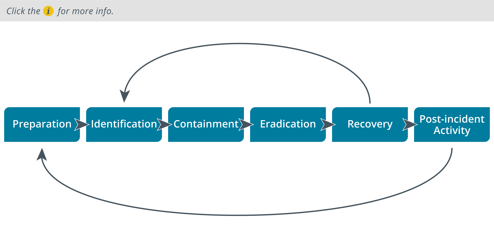

# Incident Response
### Objectives 
- Incident Response Procedures
- Appropriate Data sources for Incident Response
- Mitigation Controls

# Incident Response Procedures
Incident response policy sets the resources, processes, and guidelines for dealing with security incidents. Incident management is vital to mitigating risk. As well as controlling the immediate or specific threat to security, effective incident management preserves an organization's reputation.

- Preparation - make the system resilient to attack in the first place. This includes hardening systems, writing policies and procedures, and setting up confidential lines of communication. It also implies creating incident response resources and procedures.
- Identification - from the information in an alert or report, determine whether an incident has taken place, assess how severe it might be (triage), and notify stakeholders.
- Containment - limit the scope and magnitude of the incident. The principal aim of incident response is to secure data while limiting the immediate impact on customers and business partners.
- Eradication—once the incident is contained, remove the cause and restore the affected system to a secure state by wiping a system and applying secure configuration settings.
- Recovery - with the cause of the incident eradicated, the system can be reintegrated into the business process that it supports. Applying patches and updates to a system to help prevent future incidents is important as well. This recovery phase may involve restoration of data from backup and security testing. Systems must be monitored more closely for a period to detect and prevent any reoccurrence of the attack.
- Analysis - analyze the incident and responses to identify whether procedures or systems could be improved. It is imperative to document the incident. The outputs from this phase feed back into a new preparation phase in the cycle.

## Cyber Incident Response Team
Preparing for incident response means establishing the policies and procedures for dealing with security breaches and the personnel and resources to implement those policies.

The first challenge is defining and categorizing types of incidents.n order to identify and manage incidents, you should develop some method of reporting, categorizing, and prioritizing them (triage), in the same way that troubleshooting support incidents can be logged and managed.

Large organizations will provide a dedicated team as a single point-of-contact for the notification of security incidents. This team is variously described as a cyber incident response team (CIRT), computer security incident response team (CSIRT), or computer emergency response team (CERT). Incident response might also involve or be wholly located within a security operations center (SOC). Regardless of how the team is set up, it needs a mixture of senior management decision-makers (up to director level) who can authorize actions following the most serious incidents, managers, and technicians who can deal with minor incidents on their own initiative.

- Legal - for compliance with laws and regulations
- Human Resource(HR) -  Incident response requires the right to intercept and monitor employee communications.
- Marketing - the team is likely to require marketing or public relations input, so that any negative publicity from a serious incident can be managed.

## Communication plan and Stakeholder Management
The policies should establish clear lines of ci=ommunication, both for reporting and notifying affected parties.

- Communication Plan - Secure communication btwn trusted parties and CIRT is essential as adversaries should not be alerted of detection and renediation measures being taken.\
The team requeires off-band channnel that cannot be intercepted that has end to end encryption or uses digital signatures.

- Stakeholder Management - Trusted parties might include both internal and external stakeholders. It is not helpful for an incident to be publicized in the press or through social media outside of planned communications. Ensure that parties with privileged information do not release this information to untrusted parties, whether intentionally or inadvertently.

## Incident Response Plan(IRP)
An incident response plan (IRP) lists the procedures, contacts, and resources available to responders for various incident categories.\
A playbook (or runbook) is a data-driven standard operating procedure (SOP) to assist junior analysts in detecting and responding to specific cyberthreat scenarios

One challenge in incident management is to allocate resources efficiently. This means that identified incidents must be assessed for severity and prioritized for remediation. There are several factors that can affect this process:
- Data integrity - the value of data at risk
- Downtime - the degree at which incident interrupts business process
- Economic/publicity - reputational damage as well as business losses
- Detection time - time taken to detect
- Recovery time - time taken to impliment remedies

## Cyber Kill Chain Framework
These are the stages(kill chain) followed when attacking a target.\
The lockheed Martin Kill chain:
- Reconnaissance - attecker determines the methods to use to complete the attack as well as gathering info about target(personnel, comp systems, supply chain)
- Weaponization - Attacker couples payload code that will enable access with exploit code that will use vulnerability to execute on taarget system.
- Delivery - identifies a vector by which to transmit the weaponized code to target env
- Exploitation - weaponized code is executed on target system.
- Installation - It enables the weaponized code to run a remote access tool and achieve persistence on target system
- Command and Control(C2/C&C) - It establishes an outbound channel to a remote server that can be used to establish remote access and download additional tools to progress attack.
- Actions and Objectives - The attacker now performs their objecives and goals.

## Other Attack Frameworks
### MITRE ATTA&CK(MITRE Corporation's Adversarial Tactics, Techniques, and Common Knowledge)
It provides access to a db of known TTPs. It is freely available,each technique with aunique ID and places it in tactic categories.\
This means analysts must interpret each attack life cycle from local evidence. The framework makes TTPs used by different adversary groups directly comparable, without assuming how any particular adversary will run a campaign at a strategic level.

### The Diamond Model of Intrusion Analysis
It suggests a framework to analyze an intrusion event (E) by exploring the relationships between four core features: adversary, capability, infrastructure, and victim. These four features are represented by the four vertices of a diamond shape. Each event may also be described by meta-features, such as date/time, kill chain phase, result, and so on. Each feature is also assigned a confidence level (C), indicating data accuracy or the reliability of a conclusion or assumption assigned to the value by analysis.

## Incident Response Exercises
- Tabletop—this is the least costly type of training. The facilitator presents a scenario and the responders explain what action they would take to identify, contain, and eradicate the threat. The training does not use computer systems. The scenario data is presented as flashcards.
- Walkthroughs—in this model, a facilitator presents the scenario as for a tabletop exercise, but the incident responders demonstrate what actions they would take in response. Unlike a tabletop exercise, the responders perform actions such as running scans and analyzing sample files, typically on sandboxed versions of the company's actual response and recovery tools.
- Simulations—a simulation is a team-based exercise, where the red team attempts an intrusion, the blue team operates response and recovery controls, and a white team moderates and evaluates the exercise. This type of training requires considerable investment and planning.

## Incident Response, Disaster Recovery and Retention Policy

- Disaster Recovery Plan - a disaster can be seen as a special class of incident where the organization's primary business function is disrupted. Disaster recovery requires considerable resources, such as shifting processing to a secondary site. Disaster recovery will involve a wider range of stakeholders than less serious incidents.

- Business Continuity Plan(BCP) - this identifies how business processes should deal with both minor and disaster-level disruption. Continuity planning ensures that there is processing redundancy supporting the workflow, so that when a server is taken offline for security remediation, processing can failover to a separate system. If systems do not have this sort of planned resilience, incident response will be much more disruptive.

- Continuity Of Operation Planning(COOP) - this terminology is used for government facilities, but is functionally similar to business continuity planning. In some definitions, COOP refers specifically to backup methods of performing mission functions without IT support.

- The incident response process emphasizes containment, eradication, and recovery. 

- Digital forensics describes techniques to collect and preserve evidence that demonstrate that there has been no tampering or manipulation.

- Retention policy is also important for retrospective incident handling, or threat hunting. A retention policy for historic logs and data captured sets the period over which these are retained

# Appropriate Data Sources for Incident Response
Due to large amounts of data produced one should be able to prioritize important data.

## Incident Identification
It involves collecting events and determining whether any of them should be managed as incidents or as events that makes an incident likely to happen.

- Using log files, error messages, IDS alerts, firewall alerts as baseline to attack
- Deviations to establish metrics to recognise incidents and their scopes.
- Manual or physical inspections of site, premises, networks and hosts
- Notification by members
- New vulnerablity of systems in use

## Security Information and Event Management(SIEM)
- Correlation if a statement matches individual data points to diagnise incidents of significance
- Retention - A SIEM can enact a retention policy so that historical log and network traffic data is kept for a defined period. This allows for retrospective incident and threat hunting, and can be a valuable source of forensic evidence. 

## Trend Analysis
It is the process of detecting patterns or indicators within a data set over a time series and using those patterns to make predictions about future events.
- Frequency - It establishes a baseline metric for number of events(DNS logs) per time and if threshold exceeds, alert is raised
- Volume - based trend analysis can be performed with simpler indicators. For example, one simple metric for determining threat level is log volume. If logs are growing much faster than they were previously, there is a good chance that something needs investigating. Volume-based analysis also applies to network traffic. You might also measure endpoint disk usage.
- Statistical deviation analysis show when a data point should be treated as suspicious

## Logging Platforms
- Syslog \
It uses UDP port 514 and is usually generated by routers, switches and work stations.
- Ryslog - It uses the same configuration file syntax, but can work over TCP and use a secure connection. Rsyslog can use more types of filter expressions in its configuration file to customize message handling.
- Syslog-ng uses a different configuration file syntax, but can also use TCP/secure communications and more advanced options for message filtering. 

- Journalctl - Systemd is used to initialize the systems and to start and manage background services. Processes managed by systemd are written to a binary format file - journald. Events can then be forwarded to syslog.

- NXlog - It is an open-source log normalization tool. One principal use for it is to collect Windows logs, which use an XML-based format, and normalize them to a syslog format.

## Network, OS and Security Log Files
- System and Security Logs - Events generated are placed in categories according to interaction
    - Application - events by applications and services,when service cannot start
    - Security - Audit events, failed logon or access denial
    - System - events by OS and its services such as volume health checks
    - Setup - during OS installation
    - Forwarded events - events sent from local log to other hosts

- Network Logs -  generated by appliances such as routers, firewalls, switches, and access points. Log files will record the operation and status of the appliance itself—the system log for the appliance—plus traffic and access logs recording network behavior, such as a host trying to use a port that is blocked by the firewall, or an endpoint trying to use multiple MAC addresses when connected to a switch.

- Authentication Logs - Authentication attempts for each host are likely to be written to the security log. You might also need to inspect logs from the servers authorizing logons, such as RADIUS and TACACS+ servers or Windows Active Directory (AD) servers.

- Vulnerability Scan Output -  The scan engine might log or alert when a scan report contains vulnerabilities. The report can be analyzed to identify vulnerabilities that have not been patched or configuration weaknesses that have not been remediated. These can be correlated to recently developed exploits.

## Application Log Files
An application log file is simply one that is managed by the application rather than the OS. The application may use Event Viewer or syslog to write event data using a standard format, or it might write log files to its own application directories in whatever format the developer has selected.

- DNS Event Logs - A DNS server may log an event each time it handles a request to convert between a domain name and an IP address. DNS event logs can hold a variety of information that may supply useful security intelligence, such as:
    - Queries made by host to DNS
    - Hosts in communication with suspicious IP/Domains
    - Statistical anomalies

- Web/HTTP access Logs - Web servers are typically configured to log HTTP traffic that encounters an error or traffic that matches some predefined rule set. Most web servers use the common log format (CLF) or W3C extended log file format to record the relevant information.

- VoIP and Call Managers and Session Initial Protocol(SIP) traffic - Many VoIP systems use the Session Initiation Protocol (SIP) to identify endpoints and setup calls. The call content is transferred using a separate protocol, typically the Real-time Transport Protocol (RTP). VoIP protocols are vulnerable to most of the same vulnerabilities and exploits as web communications. Both SIP and RTP should use the secure protocol forms, where endpoints are authenticated and communications protected by Transport Layer Security (TLS).

- Dump Files - System memory contains volatile data. A system memory dump creates an image file that can be analyzed to identify the processes that are running, the contents of temporary file systems, registry data, network connections, cryptographic keys, and more. It can also be a means of accessing data that is encrypted when stored on a mass storage device. 

## Metadata
Metadata is the properties of data as it is created by an application, stored on media, or transmitted over a network. A number of metadata sources are likely to be useful when investigating incidents, because they can establish timeline questions, such as when and where, as well as containing other types of evidence. 

## Network Data Sources
Network data is typically analyzed in detail at the level of individual frames or using summary statistics of traffic flows and protocol usage.

- Protocol Analyzer Output - It will store details from sensor

# Mitigation Controls
## Incident Containment
- What damage has been done
- Countermeasures available
- Actions that could alert attacker of detection

- Isolation based Containment - Isolation involves removing an affected component from whatever larger environment it is a part of.

- Segmentation-Based Containment - Segmentation-based containment is a means of achieving the isolation of a host or group of hosts using network technologies and architecture. Segmentation uses VLANs, routing/subnets, and firewall ACLs to prevent a host or group of hosts from communicating outside the protected segment.

## Incident Eradication and Recovery
- Reconstitution of affected systems
- Reaudit security controls
- Ensure affected parties are notified

## Firewall Configuration changes
It may involve deployment of a new type of security control, altering security changes.\
Configuring egress filtering:
- Allow authorised ports and destinstion  addresses
- Restrict DNS lookups to ur own or ISPs
- Block access to known bad IP ranges
- Block unauthorised IP address
- Block access from subnets that need no connection

## Content Filter Configuration Changes
A SWG mediates user access to Internet services, with the ability to block content from regularly updated URL/domain/IP block lists and perform intrusion detection/prevention on traffic based on matching content in application layer protocol headers and payloads.

- DLP - it mediates the copying of tagged data to restrict it to authorized media and services
- Mobile Device Management(MDM) - it provides execution control over apps and features of smartphones. Features include GPS, camera, and microphone.
- Update/revoke certificates - Compromise of the private key represented by a digital certificate or the ability to present spoofed certificates as trusted is a critical security vulnerability as it allows an attacker to impersonate trusted resources and potentially gain unauthorized access to secure systems.
    - Remove compromised root certificates
    - Revoke certificates on compromised hosts

## Endpoint Configuration Changes
If endpoint security is breached, there are several classes of vector to consider for mitigation:
- Social engineering
- Vulnerabilities
- Lack of security controls
- Configuration drift
- Weak configuration

### Application Allow Lists and Block Lists
One element of endpoint configuration is an execution control policy that defines applications that can or cannot be run.
- An allow list (or approved list) denies execution unless the process is explicitly authorized.
- A block list (or deny list) generally allows execution, but explicitly prohibits listed processes.

### Quarantine
If further evidence needs to be gathered, the best approach may be to quarantine or sandbox the endpoint or suspect process/file. This allows for analysis of the attack or tool and collection of evidence using digital forensic techniques.

## Security Orchestration, Automation and Response(SOAR)
SOAR is designed as a solution to the problem of the volume of alerts overwhelming analysts' ability to respond, measured as the mean time to respond (MTTR). A SOAR may be implemented as a standalone technology or integrated with a SIEM—often referred to as a next-gen SIEM. The basis of SOAR is to scan the organization's store of security and threat intelligence, analyze it using machine/deep learning techniques, and then use that data to automate and provide data enrichment for the workflows that drive incident response and threat hunting. It can also assist with provisioning tasks, such as creating and deleting user accounts, making shares available, or launching VMs from templates, to try to eliminate configuration errors. The SOAR will use technologies such as cloud and Software-Defined Networking (SDN)/Software-Defined Visibility (SDV) APIs, orchestration tools, and cyberthreat intelligence (CTI) feeds to integrate the different systems that it is managing. It will also leverage technologies such as automated malware signature creation and user and entity behavior analytics (UEBA) to detect threats.

An incident response workflow is usually defined as a playbook. A playbook is a checklist of actions to detect and respond to a specific type of incident. A playbook should be made highly specific by including the query strings and signatures that will detect a particular type of incident. A playbook will also account for compliance factors, such as whether an incident must be reported as a breach plus when and to whom notification must be made. Where a playbook is implemented with a high degree of automation from a SOAR system, it can be referred to as a runbook, though the terms are also widely used interchangeably. The aim of a runbook is to automate as many stages of the playbook as possible, leaving clearly defined interaction points for human analysis. These interaction points should try to present all the contextual information and guidance needed for the analyst to make a quick, informed decision about the best way to proceed with incident mitigation.

## Adverarial Artificial Intelligence
Artificial Intelligence (AI)-type systems are used extensively for User and Entity Behavior Analytics (UEBA). A UEBA is trained on security data from customer systems and honeypots. 

To make use of UEBA, host event data and network traffic is streamed to a cloud-based analytics service. An attacker with undetected persistent access to the network, but with a low probability of effecting lateral movement or data exfiltration, may be in a position to inject traffic into this data stream with a long-term goal of concealing tools that could achieve actions on objectives. The attacker may use their own AI resources as a means of generating samples, hence adversarial AI. Manipulated samples could also be uploaded to public repositories, such as virustotal.com.