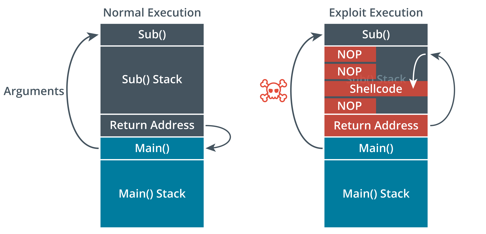
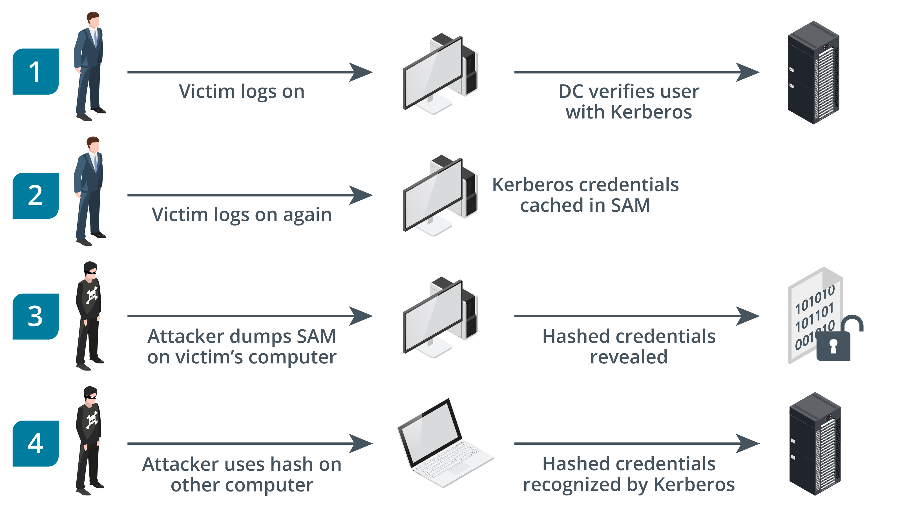
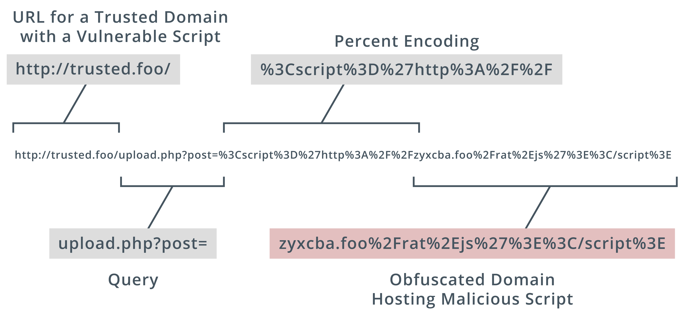
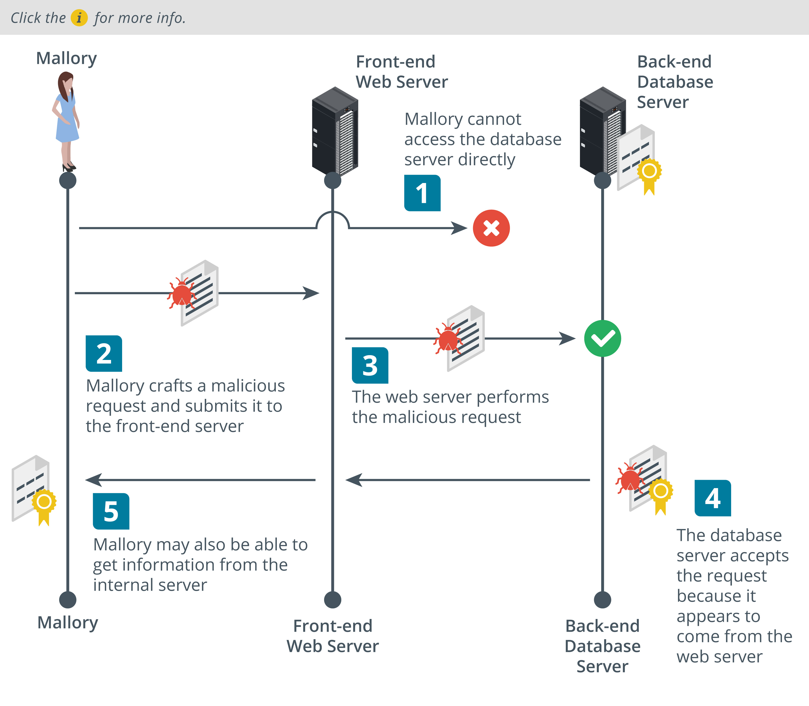

# Secure Application Concepts

### Objectives
- Indicators of Application Attacks
- Indicators of Web Attacks
- Secure Coding Practices
- Secure Script Environments
- Deployment and Automation Concepts

# Indicators of Application Attacks
An application attack targets a vulnerability in OS or application software. An application vulnerability is a design flaw that can cause the application security system to be circumvented or that will cause the application to crash

### Privilege Escalation
The purpose of most application attacks is to allow the threat actor to run his or her own code on the system. This is referred to as arbitrary code execution. Where the code is transmitted from one machine to another, it can be referred to as remote code execution. The code would typically be designed to install some sort of backdoor or to disable the system in some way (denial of service).

Depending on how the software is written, a process may run using a system account, the account of the logged-on user, or a nominated account. If a software exploit works, the attacker may be able to execute arbitrary code with the same privilege level as the exploited process or attempt a privilege escalation technique. There are two main types of privilege escalation:
- Vertical privilege escalation (or elevation) is where a user or application can access functionality or data that should not be available to them. For instance, a process might run with local administrator privileges, but a vulnerability allows the arbitrary code to run with higher system privileges
- Horizontal privilege escalation is where a user accesses functionality or data that is intended for another user. For instance, via a process running with local administrator privileges on a client workstation, the arbitrary code is able to execute as a domain account on an application server.

### Error Handling
An application attack may cause an error message. In Windows, this may be of the following types: "Instruction could not be read or written," "Undefined exception," or "Process has encountered a problem." One issue for error handling is that the application should not reveal configuration or platform details that could help an attacker. For example, an unhandled exception on a web application might show an error page that reveals the type and configuration of a database server.

### Improper Input Handling
Most software accepts user input of some kind, whether the input is typed manually or passed to the program by another program, such as a browser passing a URL to a web server or a Windows process using another process via its application programming interface. Good programming practice dictates that input should be tested to ensure that it is valid; that is, the sort of data expected by the receiving process. Most application attacks work by passing invalid or maliciously constructed data to the vulnerable process. There are many ways of exploiting improper input handling, but many attacks can be described as either overflow-type attacks or injection-type attacks.

## Overflow Vulnerabilities
In an overflow attack, the threat actor submits input that is too large to be stored in a variable assigned by the application.

### Buffer Overflow
A buffer is an area of memory that the application reserves to store expected data. To exploit a buffer overflow vulnerability, the attacker passes data that deliberately overfills the buffer.\
One of the most common vulnerabilities is a stack overflow. The stack is an area of memory used by a program subroutine. It includes a return address, which is the location of the program that has called the subroutine. An attacker could use a buffer overflow to change the return address, allowing the attacker to run arbitrary code on the system. 


### Integer Overflow
Integers (whole numbers) are widely used as a data type, where they are commonly defined with fixed lower and upper bounds. An integer overflow attack causes the target software to calculate a value that exceeds these bounds. This may cause a positive number to become negative (changing a bank debit to a credit, for instance). It could also be used where the software is calculating a buffer size.

## Null Pointer Dereferencing and Race Conditions
************************************

## Memory Leaks and Resource Exhaustion
Memory leaks are particularly serious in service/background applications, as they will continue to consume memory over an extended period. Memory leaks in the OS kernel are also extremely serious. A memory leak may itself be a sign of a malicious or corrupted process.

More generally, a malicious process might cause denial of service or set up the conditions for privilege escalation via resource exhaustion. Resources refers to CPU time, system memory allocation, fixed disk capacity, and network utilization. A malicious process could spawn multiple looping threads to use up CPU time, or write thousands of files to disk. Distributed attacks against network applications perform a type of resource exhaustion attack by starting but not completing sessions, causing the application to fill up its state table, leaving no opportunities for genuine clients to connect.

## DLL Injection and Driver Manipulation
A dynamic link library (DLL) is a binary package that implements some sort of standard functionality, such as establishing a network connection or performing cryptography. The main process of a software application is likely to load several DLLs during the normal course of operations.

DLL injection is a vulnerability in the way the operating system allows one process to attach to another. This functionality can be abused by malware to force a legitimate process to load a malicious link library. The link library will contain whatever functions the malware author wants to be able to run. Malware uses this technique to move from one host process to another to avoid detection. A process that has been compromised by DLL injection might open unexpected network connections, or interact with files and the registry suspiciously.

To perform DLL injection the malware must already be operating with sufficient privileges, typically local administrator or system privileges. It must also evade detection by anti-virus software. One means of doing this is code refactoring. Refactoring means that the code performs the same function by using different methods (control blocks, variable types, and so on). Refactoring means that the A-V software may no longer identify the malware by its signature.

OS function calls to allow DLL injection are legitimately used for operations such as debugging and monitoring. Another opportunity for malware authors to exploit these calls is the Windows Application Compatibility framework. This allows legacy applications written for an OS, such as Windows XP, to run on later versions. The code library that intercepts and redirects calls to enable legacy mode functionality is called a shim. The shim must be added to the registry and its files (packed in a shim database/.SDB file) added to the system folder. The shim database represents a way that malware with local administrator privileges can run on reboot (persistence).

## Pass The Hash Attack
Attackers can extend their lateral movement by a great deal if they are able to compromise host credentials. One common credential exploit technique for lateral movement is called pass the hash (PtH). This is the process of harvesting an account's cached credentials when the user is logged into a single sign-on (SSO) system so the attacker can use the credentials on other systems. If the threat actor can obtain the hash of a user password, it is possible to present the hash (without cracking it) to authenticate to network protocols such as the Windows File Sharing protocol Server Message Block (SMB), and other protocols that accept Windows NT LAN Manager (NTLM) hashes as authentication credentials. For example, most Windows domain networks are configured to allow NTLM as a legacy authentication method for services. The attacker's access isn't just limited to a single host, as they can pass the hash onto any computer in the network that is tied to the domain. This drastically cuts down on the effort the threat actor must spend in moving from host to host.


# Indicators of Web Application Attacks
## Uniform Resource Locator(URL) Analysis
As well as pointing to the host or service location on the Internet (by domain name or IP address), a uniform resource locator (URL) can encode some action or data to submit to the server host. This is a common vector for malicious activity. 


### HTTP Methods\
An HTTP session starts with a client (a user-agent, such as a web browser) making a request to an HTTP server. The connection establishes a TCP connection. This TCP connection can be used for multiple requests, or a client can start new TCP connections for different requests. A request typically comprises a method, a resource (such as a URL path), version number, headers, and body. The principal method is GET, used to retrieve a resource. Other methods include:
- POST—send data to the server for processing by the requested resource.
- PUT—create or replace the resource.
- DELETE—can be used to remove the resource.
- HEAD—retrieve the headers for a resource only (not the body).

Data can be submitted to a server either by using a POST or PUT method and the HTTP headers and body, or by encoding the data within the URL used to access the resource. Data submitted via a URL is delimited by the ? character, which follows the resource path. Query parameters are usually formatted as one or more name=value pairs, with ampersands delimiting each pair. A URL can also include a fragment or anchor ID, delimited by #. The fragment is not processed by the web server. An anchor ID is intended to refer to a section of a page but can be misused to inject JavaScript

### Pacentage Encoding
A URL can contain only unreserved and reserved characters from the ASCII set. Reserved ASCII characters are used as delimiters within the URL syntax and should only be used unencoded for those purposes. The reserved characters are:

> : / ? # [ ] @ ! $ & ' ( ) * + , ; =

There are also unsafe characters, which cannot be used in a URL. Control characters, such as null string termination, carriage return, line feed, end of file, and tab, are unsafe. Percent encoding allows a user-agent to submit any safe or unsafe character (or binary data) to the server within the URL. Its legitimate uses are to encode reserved characters within the URL when they are not part of the URL syntax and to submit Unicode characters. Percent encoding can be misused to obfuscate the nature of a URL (encoding unreserved characters) and submit malicious input. Percent encoding can exploit weaknesses in the way the server application performs decoding. Consequently, URLs that make unexpected or extensive use of percent encoding should be treated carefully. 

## Application Programming Interface
Web applications and cloud services implement application program interfaces (APIs) to allow consumers to automate services. An API call might use the following general URL format:

> https://webapp.foo/?Action=RunInstance&Id=123&Count=1&InstanceAccessKey= MyInstanceAccessKey&Placement=us-east&MyAuthorizationToken

## Replay Attacks
A replay attack works by sniffing or guessing the token value and then submitting it to re-establish the session illegitimately.\
Session management enables web applications to uniquely identify a user across a number of different actions and requests. Session management is particularly important when it comes to user authentication, as it is required to ensure the integrity of the account and the confidentiality of data associated with it. 

HTTP is a stateless protocol, as it preserves no data. A cookie is created when the server sends an HHTP response header with the cookie data.\
A cookie has a name and value, plus optional security and expiry attributes. Subsequent request headers sent by the client will usually include the cookie. Cookies are either nonpersistent (session) cookies, in which case they are stored in memory and deleted when the browser instance is closed, or persistent, in which case they are stored in the browser cache until deleted by the user or pass a defined expiration date.

## Session Hijacking
session hijacking most often means replaying a cookie in some way. Attackers can sniff network traffic to obtain session cookies sent over an unsecured network, like a public Wi-Fi hotspot. To counter cookie hijacking, you can encrypt cookies during the transmission process, delete cookies from the client's browser cache when the client terminates the session, and design your web app to deliver a new cookie with each new session between the app and the client's browser.

Session prediction attacks focus on identifying possible weaknesses in the generation of session tokens that will enable an attacker to predict future valid session values. If an attacker can predict the session token, then the attacker can take over a session that has yet to be established. A session token must be generated using a non-predictable algorithm, and it must not reveal any information about the session client. In addition, proper session management dictates that apps limit the lifespan of a session and require reauthentication after a certain period

## Cross-Site Request Forgery
It can exploit applications that use cookies to authenticate users and track sessions.
- Attacker must convince the victim to start a session with the target site.
- Attacker passes HTTP request to victim`s browser that spoofs action on target site
    - This request could be disguised in a few ways and so could be accomplished without the victim necessarily having to click a link. If the target site assumes that the browser is authenticated because there is a valid session cookie and doesn't complete any additional authorization process on the attacker's input (or if the attacker is able to spoof the authorization), it will accept the input as genuine. This is also referred to as a confused deputy attack (the point being that the user and the user's browser are not necessarily the same thing).

## Clickjacking
An attack where the user sees and trusts a web application with sort of lgin,form,actions that contains malicious layer or invisible iframe(webpage embedded in a another web page) that allows attacker to intercept or redirect user input.\
Clickjacking can be launched using any type of compromise that allows the adversary to run arbitrary code as a script.

## SSL Strip
A Secure Sockets Layer (SSL) strip attack is launched against clients on a local network as they try to make connections to websites. The threat actor must first perform a Man-in-the-Middle attack via Address Resolution Protocol (ARP) poisoning to masquerade as the default gateway. When a client requests an HTTP site that redirects to an HTTPS site in an unsafe way, the sslstrip utility (https://github.com/moxie0/sslstrip) proxies the request and response, serving the client the HTTP site, hopefully with an unencrypted login form. If the user enters credentials, they will be captured by the threat actor. Sites can use the HTTP Strict Transport Security (HSTS) lists maintained by browsers to prevent clients requesting HTTP in the first place. 

## Cross-Site Scripting(XSS)
A cross-site scripting (XSS) attack exploits the fact that the browser is likely to trust scripts that appear to come from a site the user has chosen to visit. XSS inserts a malicious script that appears to be part of the trusted site.\
A nonpersistent XSS:
- The attacker identifies an input validation vulnerability in the trusted site.
- The attacker crafts a URL to perform a code injection against the trusted site. This could be coded in a link from the attacker's site to the trusted site or a link in an email message.
- When the user clicks the link, the trusted site returns a page containing the malicious code injected by the attacker. As the browser is likely to be configured to allow the site to run scripts, the malicious code will execute

An attack where the malicious input comes from a crafted link is a reflected or nonpersistent XSS attack.\
A stored/persistent XSS attack aims to insert code into a back-end database or content management system used by the trusted site. 
-  For example, the attacker may submit a post to a bulletin board with a malicious script embedded in the message. When other users view the message, the malicious script is executed. For example, with no input sanitization, a threat actor could type the following into a new post text field:
Users viewing the post will have the malicious script hook.js execute in their browser.
   ```js
   Check out this amazing
   <a href="https://trusted.foo">website</  a><script src="https://badsite.foo/hook.js"></script>.
   ``` 

A third type of XSS attack exploits vulnerabilities in client-side scripts. Such scripts often use the Document Object Model (DOM) to modify the content and layout of a web page. For example, the "document.write" method enables a page to take some user input and modify the page accordingly. An exploit against a client-side script could work as follows:
- The attacker identifies an input validation vulnerability in the trusted site. For example, a message board might take the user's name from an input text box and show it in a header.
>    https://trusted.foo/messages?user=james
- The attacker crafts a URL to modify the parameters of a script that the server will return, such as:
>  https://trusted.foo/messages?user=James%3Cscript%20src%3D%22https%3A%2F%2Fba
- The server returns a page with the legitimate DOM script embedded, but containing the parameter:
```js
 James<script src="https://badsite.foo/hook.js"></script>
```
- The browser renders the page using the DOM script, adding the text "James" to the header, but also executing the hook.js script at the same time.

## SQL
A web application is likely to use Structured Query Language (SQL) to read and write information from a database. The main database operations are performed by SQL statements for selecting data (SELECT), inserting data (INSERT), deleting data (DELETE), and updating data (UPDATE). In a SQL injection attack, the threat actor modifies one or more of these four basic functions by adding code to some input accepted by the app, causing it to execute the attacker's own set of SQL queries or parameters. If successful, this could allow the attacker to extract or insert information into the database or execute arbitrary code on the remote system using the same privileges as the database application (owasp.org/www-community/attacks/SQL_Injection).

For example, consider a web form that is supposed to take a name as input. If the user enters "Bob", the application runs the following query:
> SELECT * FROM tbl_user WHERE username = 'Bob'

If a threat actor enters the string ' or 1=1-- and this input is not sanitized, the following malicious query will be executed:

> SELECT * FROM tbl_user WHERE username = '' or 1=1--'

The logical statement 1=1 is always true, and the -- string turns the rest of the statement into a comment, making it more likely that the web application will parse this modified version and dump a list of all users.

## XML(Extensible Markup Language) Injection
It is used by apps for authentication and authorizations, and for other types of data exchange and uploading. Data submitted via XML with no encryption or input validation is vulnerable to spoofing, request forgery, and injection of arbitrary data or code. For example, an XML External Entity (XXE) attack embeds a request for a local resource (owasp.org/www-community/vulnerabilities/XML_External_Entity_(XXE)_Processing).

``` xml
<?xml version="1.0" encoding="UTF-8"?>

<!DOCTYPE foo [<!ELEMENT foo ANY ><!ENTITY bar SYSTEM "file:///etc/config"> ]>

<bar>&bar;</bar>
```
This defines an entity named bar that refers to a local file path. A successful attack will return the contents of /etc/config as part of the response.

## Lightweight Directory Access Protocol (LDAP) Injection
The Lightweight Directory Access Protocol (LDAP) is another example of a query language. LDAP is specifically used to read and write network directory databases. A threat actor could exploit either unauthenticated access or a vulnerability in a client app to submit arbitrary LDAP queries. This could allow accounts to be created or deleted, or for the attacker to change authorizations and privileges (owasp.org/www-community/attacks/LDAP_Injection).

LDAP filters are constructed from (name=value) attribute pairs delimited by parentheses and the logical operators AND (&) and OR (|). Adding filter parameters as unsanitized input can bypass access controls. For example, if a web form authenticates to an LDAP directory with the valid credentials Bob and Pa$$w0rd, it may construct a query such as this from the user input:

> (&(username=Bob)(password=Pa$$w0rd))

Both parameters must be true for the login to be accepted. If the form input is not sanitized, a threat actor could bypass the password check by entering a valid username plus an LDAP filter string, such as Bob)(&)). This causes the password filter to be dropped for a condition that is always true:

> (&(username=Bob)(&))

## Directory Traversal
Directory traversal is another type of injection attack performed against a web server. The threat actor submits a request for a file outside the web server's root directory by submitting a path to navigate to the parent directory (../). This attack can succeed if the input is not filtered properly and access permissions on the file are the same as those on the web server directory.

The threat actor might use a canonicalization attack to disguise the nature of the malicious input. Canonicalization refers to the way the server converts between the different methods by which a resource (such as a file path or URL) may be represented and submitted to the simplest (or canonical) method used by the server to process the input. Examples of encoding schemes include HTML entities and character set percent encoding (ASCII and Unicode). An attacker might be able to exploit vulnerabilities in the canonicalization process to perform code injection or facilitate directory traversal. For example, to perform a directory traversal attack, the attacker might submit a URL such as:

> http://victim.foo/?show=../../../../etc/config

A limited input validation routine would prevent the use of the string ../ and refuse the request. If the attacker submitted the URL using the encoded version of the characters, he or she might be able to circumvent the validation routine:

> http://victim.foo/?show=%2e%2e%2f%2e%2e%2f%2e%2e%2f%2e%2e%2fetc/conf

## Command Injection
A command injection attack attempts to cause the server to run OS shell commands and return the output to the browser. As with directory traversal, the web server should normally be able to prevent commands from operating outside of the server's directory root and to prevent commands from running with any other privilege level than the web "guest" user (who is normally granted only very restricted privileges). A successful command injection attack would find some way of circumventing this security (or find a web server that is not properly configured). 

## Server-Side Request Forgery
A server-side request forgery (SSRF) causes the server application to process an arbitrary request that targets another service, either on the same host or a different one (owasp.org/www-community/attacks/Server_Side_Request_Forgery).\
SSRF exploits both the lack of authentication between the internal servers and services (implicit trust) and weak input validation, allowing the attacker to submit unsanitized requests or API parameters.

A web application takes API input via a URL or as data encoded in HTTP response headers. The web application is likely to use a standard library to read (parse) the URL or response headers. Many SSRF attacks depend on exploits against specific parsing mechanisms in standard libraries for web servers, such as Apache or IIS, and web application programming languages and tools, such as the curl library, Java, and PHP. SSRF can also use XML injection to exploit weaknesses in XML document parsing

One type of SSRF uses HTTP request splitting or CRLF injection. The attacker crafts a malicious URL or request header targeting the server's API. The request contains extra line feeds, which may be coded in some non-obvious way. Unless the web server strips these out when processing the URL, it will be tricked into performing a second HTTP request.

SSRF attacks are often targeted against cloud infrastructure where the web server is the only public-facing component of a deeper processing chain. A typical web application comprises multiple layers of servers, with a client interface, middleware logic layers, and a database layer. Requests initiated from the client interface (a web form) are likely to require multiple requests and responses between the middleware and back-end servers. These will be implemented as HTTP header requests and responses between each server's API. SSRF is a means of accessing these internal servers by causing the public server to execute requests on them. While with CSRF an exploit only has the privileges of the client, with SSRF the manipulated request is made with the server's privilege level.

used on:
- Reconnaissance
- Credential Stealing
- Unauthorized requests
- Prorocol smuggleing

# Coding Practices
The security considerations for new programming technologies should be well understood and tested before deployment. One of the challenges of application development is that the pressure to release a solution often trumps any requirement to ensure that the application is secure. A legacy software design process might be heavily focused on highly visible elements, such as functionality, performance, and cost. Modern development practices use a security development life cycle running in parallel or integrated with the focus on software functionality and usability.
- Input Validation - Malicious input could be crafted to perform an overflow attack or some type of script or SQL injection attack. To mitigate this risk, all input methods should be documented with a view to reducing the potential attack surface exposed by the application. There must be routines to check user input, and anything that does not conform to what is required must be rejected.
- Out encoding -  Normalization means that a string is stripped of illegal characters or substrings and converted to the accepted character set. This ensures that the string is in a format that can be processed correctly by the input validation routines.\
Output encoding means that the string is re-encoded safely for the context in which it is being used. For example, a web form might perform input validation at the client, but when it reaches the server, a PHP function performs output encoding before composing an SQL statement. Similarly, when a string is delivered from a database using SQL, a JavaScript function would perform output encoding to render the string using safe HTML entities
- Error handling - without revealing info about the serveice

## Web Application Security
With web applications, special attention must be paid to secure cookies and options for HTTP response header security.

- Secure Cookies - Cookies can be a vector for session hijacking and data exposure if not configured correctly (developer.mozilla.org/en-US/docs/Web/HTTP/Cookies). Some of the key parameters for the SetCookie header are:
    - Persistent cookie
    - Secure Attribute to prevent cookie being sent over
    - HTTPOnly to make cookie inaccessible to unecrypted HTTP
    - Use the SameSite attribute to control from where a cookie may be sent, mitigating request forgery attacks.

- Response Headers - A no. of security options set in response header returned by the server to the client. Implimentation and compatibility of versions and types can be an issue.
    - Http Strict Transport Policy(HSTS) - only HTTPs(downgrade and SSL stripping attacks)
    - Content Security Policy(CSP) - mitigates clickjacking, script injection, and other client-side attacks. Note that X-Frame-Options and X-XSS-Protection provide mitigation for older browser versions, but are now deprecated in favor of CSP.
    - Cache Control - whether to cache responses

## Data Exposure and Memory Management
Data exposure is a fault that allows privileged information (such as a token, password, or personal data) to be read without being subject to the appropriate access controls

### Error hangling
Structures Exception Handlers(SEH) to dictate what the application should do in case of error or an exception.

### Memory Management
Many arbitrary code attacks depend on the target application having faulty memory management procedures. This allows the attacker to execute his or her own code in the space marked out by the target application. There are known unsecure practices for memory management that should be avoided and checks for processing untrusted input, such as strings, to ensure that it cannot overwrite areas of memory.

## Secure Code Usage
- Code reuse
- Third party library
- Software Development Kit(SDK)
- Stored Procedures - custom query

* Unreachable Code and Dead Code
    Unreachable code is one that can never be executed\
    Dead code is one that has no effect on workflow
* Obfuscation/Camouflage
    Code can be made difficult to analyze by using an obfuscator, which is software that randomizes the names of variables, constants, functions, and procedures, removes comments and white space, and performs other operations to make the compiled code physically and mentally difficult to read and follow. This sort of technique might be used to make reverse engineering an application more difficult and as a way of disguising malware code.

* Static code analysis (or source code analysis) is performed against the application code before it is packaged as an executable process. The analysis software must support the programming language used by the source code. The software will scan the source code for signatures of known issues, such as OWASP Top 10 Most Critical Web Application Security Risks or injection vulnerabilities generally.

* Human analysis of software source code is described as a manual code review. It is important that the code be reviewed by developers (peers) other than the original coders to try to identify oversights, mistaken assumptions, or a lack of knowledge or experience. It is important to establish a collaborative environment in which reviews can take place effectively.

* Dynamic code Analysis - It is performed in real world conditions.
    - DYNAMIC CODE ANALYSIS\
        Static code review techniques will not reveal vulnerabilities that might exist in the runtime environment, such as exposure to race conditions or unexpected user input. Dynamic analysis means that the application is tested under "real world" conditions using a staging environment.

        Fuzzing is a means of testing that an application's input validation routines work well. Fuzzing means that the test or vulnerability scanner generates large amounts of deliberately invalid and/or random input and records the responses made by the application. This is a form of "stress testing" that can reveal how robust the application is. There are generally three types of fuzzers, representing different ways of injecting manipulated input into the application:

        - Application UI - identify input streams accepted by the application, such as input boxes, command line switches, or import/export functions.
        - Protocol - transmit manipulated packets to the application, perhaps using unexpected values in the headers or payload.
        - File Format - attempt to open files whose format has been manipulated, perhaps manipulating specific features of the file.

# Secure Scripting Environments
Scripts can be used to return critical security assessment data and to configure hosts, so it is important that only validated code can be executed. You should also be able to identify malicious code in scripts and macros.

## Scripting
### Powershell Script Environment
### Bash and Python Malicious Indicators
### Macros and Visual Basic for Applications
### Man In the Browser Attack

# Deployment and Automation Concepts
