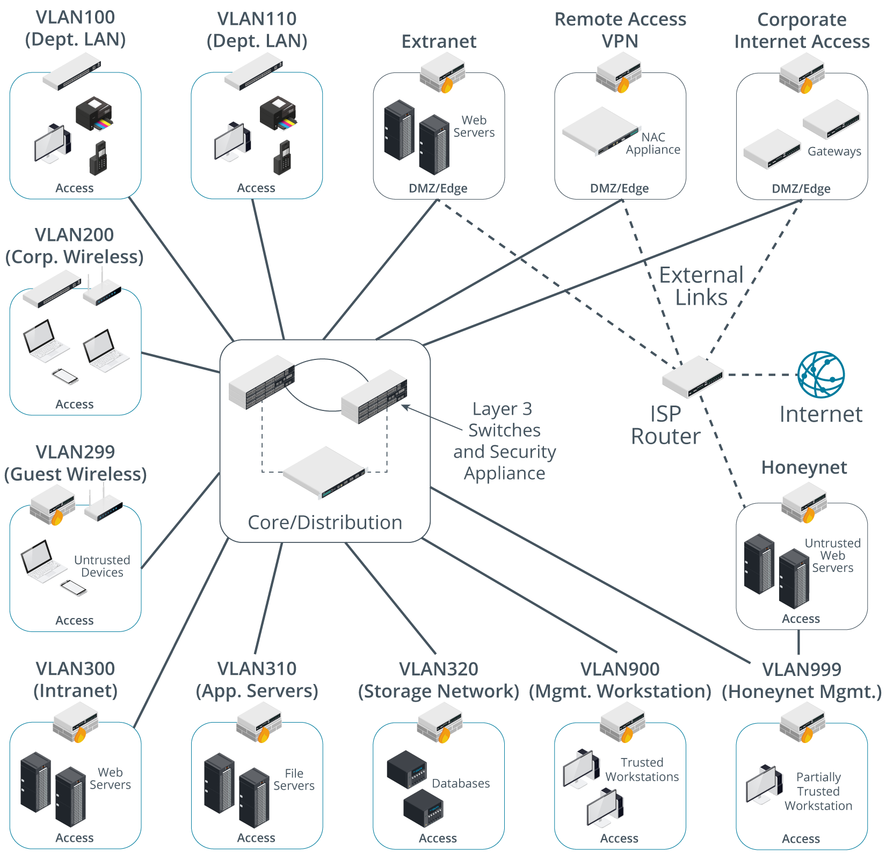
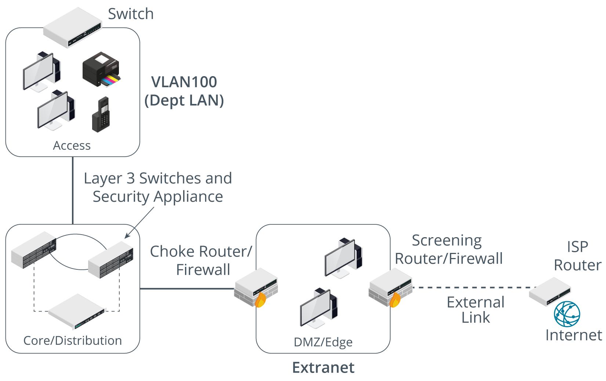
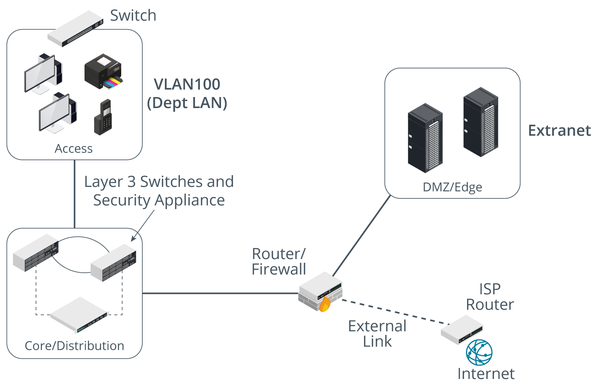
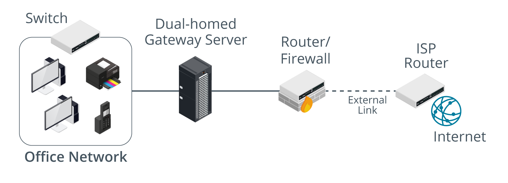
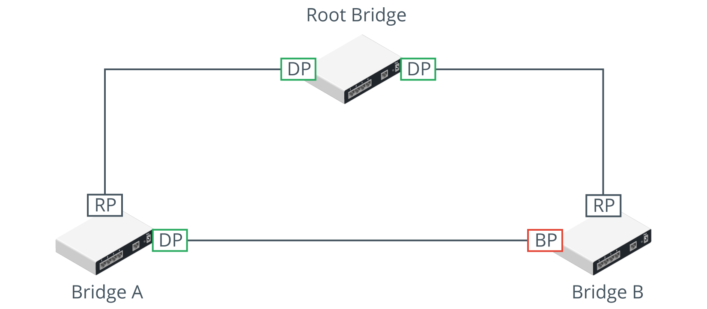
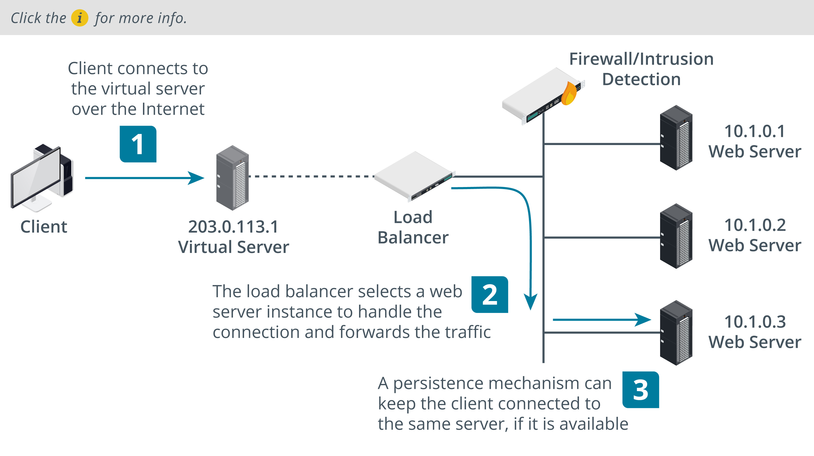

# Secure Network Designs
A secure network design provisions the assets and services underpinning business workflows with the properties of confidentiality, integrity, and availability. Weaknesses in the network architecture make it more susceptible to undetected intrusions or to catastrophic service failures.

### Objectives
- Secure network designs
- Secure routing and switching
- Secure wireless infrastructure
- Load balancers

## Secure Network Designs
Weaknesses :-
- Single point of failure
- Complex dependencies
- Availability over confidentiality and integrity
- Lack of documentation and cahnge control
- Overdependence on perimeter security

#### Business workflows and network architecture
Network architecture is designed to support business workflows. 
Supporting email workflow
- Access - the device must access the network, obtain physical and logical address and be authenticated by email application.
- Email mailbox server - Mailbox accessed only by authorized clients and is fully available and fault torelant.(min dependencies and resilient to fault)
- Mail transfer server - connects with untrusted internet hosts, so communications between the untrusted network and trusted LAN must be carefully controlled. 

#### Neetwork Appliances
A number of network appliances are involved in provisioning a network architecture
- Switches - Forwards frames btwn nodes in a cabled network.Work at layer 2 using Media Access Control(MAC) to make forwarding decisions. Switches can establish network segments that either map directly to the underlying cabling or logical segments, created in the switch configuration as  virtual LANs (VLANs)
- Wireless Access points - provide a bridge between a cabled network and wireless clients, or stations. Access points work at layer 2 of the OSI model.
- Routers - forward packets around an internetwork, making forwarding decisions based on IP addresses. Routers work at layer 3 of the OSI model. Routers can apply logical IP subnet addresses to segments within a network.
- Firewalls - apply an access control list (ACL) to filter traffic passing in or out of a network segment. Firewalls can work at layer 3 of the OSI model or higher.
- Load balancers—distribute traffic between network segments or servers to optimize performance. Load balancers can work at various layers of the OSI model.
- DNS - host name records and perform name resolution to allow applications and users to address hosts and services using fully qualified domain names (FQDNs) rather than IP addresses. DNS works at layer 7 of the OSI model. Name resolution is a critical service in network design. Abuse of name resolution is a common attack vector.

#### Routing protocols
A route to a network can be configured statically, but most networks use routing protocols to transmit new and updated routes between routers. Some common routing protocols include Border Gateway Protocol (BGP), Open Shortest Path First (OSPF), Enhanced Interior Gateway Routing Protocol (EIGRP), and Routing Information Protocol (RIP).

#### Network segmentation
A network segment is one where all the hosts attached to the segment can use local (layer 2) forwarding to communicate freely with one another. The hosts are said to be within the same broadcast domain

Segregation means that the hosts in one segment are restricted in the way they communicate with hosts in other segments. They might only be able to communicate over certain network ports, for instance.

Any given switch port can be assigned to any VLAN in the same topology, regardless of the physical location of the switch. The segmentation enforced by VLANs at layer 2 can be mapped to logical divisions enforced by IP subnets at layer 3.

#### Network topology and zones
A topology is a description of how a computer network is physically or logically organized. The logical and physical network topology should be analyzed to identify points of vulnerability and to ensure that the goals of confidentiality, integrity, and availability are met by the design.

A zone is an area of the network where the security configuration is the same for all hosts within it. Zones should be segregated from one another by physical and/or logical segmentation, using VLANs and subnets.Traffic between zones should be strictly controlled using a security device, typically a firewall.

- Intranet(private network) - 
this is a network of trusted hosts owned and controlled by the organization. Within the intranet, there may be sub-zones for different host groups, such as servers, employee workstations, VoIP handsets, and management workstations.
- Extranet - 
this is a network of semi-trusted hosts, typically representing business partners, suppliers, or customers. Hosts must authenticate to join the extranet.
- Internet/guest—this is a zone permitting anonymous access (or perhaps a mix of anonymous and authenticated access) by untrusted hosts over the Internet.

### Demilitarized zones(DMZ) / perimeter / edge network
An Internet-facing host accepts inbound connections from and makes connections to hosts on the Internet.Internet-facing hosts are placed in one or more demilitarized zones (DMZs). 

If communication is required between hosts on either side of a DMZ, a host within the DMZ acts as a proxy. For example, if an intranet host requests a connection with a web server on the Internet, a proxy in the DMZ takes the request and checks it.\
If the request is valid, it retransmits it to the destination. External hosts have no idea about what (if anything) is behind the DMZ.

The hosts that provide the extranet or public access services should be placed in one or more demilitarized zones. These would typically include web servers, mail and other communications servers, proxy servers, and remote access servers.\

They are referred to as bastion hosts and run minimal services to reduce the attack surface as much as possible. A bastion host would not be configured with any data that could be a security risk to the internal network, such as user account credentials.
- DMZ hosting proxies or secure web gateways to allow employees access to web browsing and internet services
- A DMZ hosting communication servers, such as email, VoIP, and conferencing.
- A DMZ for servers providing remote access to the local network via a Virtual Private Network (VPN).
- A DMZ hosting traffic for authorized cloud applications.
- A multi-tier DMZ to isolate front-end, middleware, and back-end servers.

#### DMZ topology
To configure a DMZ, two different security configurations must be enabled: one on the external interface and one on the internal interface. A DMZ and intranet are on different subnets, so communications between them need to be routed.

#### Screened subnet
A screened subnet uses two firewalls placed on either side of the DMZ. The edge firewall restricts traffic on the external/public interface and allows permitted traffic to the hosts in the DMZ. The edge firewall can be referred to as the screening firewall or router. The internal firewall filters communications between hosts in the DMZ and hosts on the LAN. This firewall is often described as the choke firewall. A choke point is a purposefully narrow gateway that facilitates better access control and easier monitoring.

#### Triple-Homed firewall
A DMZ can also be established using one router/firewall appliance with three network interfaces, referred to as triple-homed. One interface is the public one, another is the DMZ, and the third connects to the LAN.
Routing and filtering rules determine what forwarding is allowed between these interfaces. This can achieve the same sort of configuration as a screened subnet.

#### Screened hosts
Smaller networks may not have the budget or technical expertise to implement a DMZ. In this case, Internet access can still be implemented using a dual-homed proxy/gateway server acting as a screened host.

This might be simpler to configure and solve some access problems, but it makes the whole network very vulnerable to intrusion and DoS. An enterprise DMZ is established by a separate network interface and subnet so that traffic between hosts in the DMZ and the LAN must be routed (and subject to firewall rules). Most SOHO routers do not have the necessary ports or routing functionality to create a true DMZ.

### Implications of IPv6
If IPv6 is enabled but unmanaged, there is the potential for malicious use as a backdoor or covert channel. IPv6 also exposes novel attack vectors, such as spoofing and DoS attacks on neighbor discovery.

Hosts should be allocated IPv6 addresses that map to the same zones as the IPv4 topology. Firewalls should be configured with ACLs that either achieve the same security configuration as for IPv4 or block IPv6, if that is a better option. One issue here is that IPv6 is not intended to perform any type of address translation.

### Other secure network design considerations
Network design must also be considered for data centers and the cloud. A data center is a facility dedicated to hosting servers, rather than a mix of server and client workstation machines.

#### East-West Traffic
Traffic that goes to and from a data center is referred to as north-south. This traffic represents clients outside the data center making requests and receiving responses. In data centers that support cloud and other Internet services, most traffic is actually between servers within the data center. This is referred to as east-west traffic.

The preponderance of east-west traffic complicates security design. If each of these cascading transactions were to pass through a firewall or other security appliance, it would create a severe bottleneck. These requirements are driving the creation of virtualized security appliances that can monitor traffic as it passes between servers (blogs.cisco.com/security/trends-in-data-center-security-part-1-traffic-trends).

#### Zero trust
Zero trust architectures assume that nothing should be taken for granted and that all network access must be continuously verified and authorized. Any user, device, or application seeking access must be authenticated and verified.

## Secure switching and routing

### Layer 2 attacks
Attacks in Layer 1(physical) and layer 2(Data link) are focused on information gathering, network mapping and eavesdropping on network traffic

#### Main the middle attack(MITM) / On path
where the threat actor gains a position between two hosts, and transparently captures, monitors, and relays all communication between the hosts.

An on-path attack could also be used to covertly modify the traffic. For example, a MitM host could present a workstation with a spoofed website form, to try to capture the user credential.

Another common on-path attack spoofs responses to DNS queries, redirecting users to spoofed websites. On-path attacks can be defeated using mutual authentication, where both hosts exchange secure credentials, but at layer 2 it is not always possible to put these controls in place.

#### Mac cloning
It changes the hardware address configured on an adapter interface or asserts the use of an arbitrary MAC address. While a unique MAC address is assigned to each network interface by the vendor at the factory, it is simple to override it in software via OS commands, alterations to the network driver configuration, or using packet crafting software. 

#### ARP Poisoning
An ARP poisoning attack uses a packet crafter, such as Ettercap, to broadcast unsolicited ARP reply packets. Because ARP has no security mechanism, the receiving devices trust this communication and update their MAC:IP address cache table with the spoofed address. 

#### Mac flooding attacks
Where ARP poisoning is directed at hosts, MAC flooding is used to attack a switch. The intention of the attacker is to exhaust the memory used to store the switch's MAC address table. 

The switch uses the MAC address table to determine which port to use to forward unicast traffic to its correct destination. Overwhelming the table can cause the switch to stop trying to apply MAC-based forwarding and flood unicast traffic out of all ports, working as a hub. This makes sniffing network traffic easier for the threat actor.

#### Loop prevention
In a network with multiple bridges, implemented these days as switches, there may be more than one path for a frame to take to its intended destination. As a layer 2 protocol, Ethernet has no concept of Time To Live. Therefore, layer 2 broadcast traffic could continue to loop through a network with multiple paths indefinitely.

Layer 2 loops are prevented by the <u>Spanning Tree Protocol (STP)</u>. Spanning tree is a means for the bridges to organize themselves into a hierarchy and prevent loops from forming.

The root bridge has two designated ports (DP) connected to Bridge A and Bridge B. Bridges A and B both have root ports (RP) connected back to the interfaces on the root bridge. Bridges A and B also have a connection directly to one another. On Bridge A, this interface is active and traffic for Bridge B can be forwarded directly over it. On Bridge B, the interface is blocked (BP) to prevent a loop and traffic for Bridge A must be forwarded via the root bridge. Only Bridge Protocol Data Unit (BPDU) traffic will go across a blocked port.

#### Broadcast Storm prevention
STP is principally designed to prevent broadcast storms

If a bridged network contains a loop, broadcast traffic will travel through the network, get amplified by the other switches, and arrive back at the original switch, which will re-broadcast each incoming broadcast frame, causing an exponential increase (the storm), which will rapidly overwhelm the switches and crash the network.

A storm control setting on a switch is a backup mechanism to rate-limit broadcast traffic above a certain threshold.

#### Bridge Protocol Data unit(BPDU) Guard
Bridge Protocol Data Units (BPDUs) are used to communicate information about the topology and are not expected on access ports, so BPDU Guard protects against misconfiguration or a possible malicious attack.

A threat actor might try to attack STP using a rogue switch or software designed to imitate a switch. When a switch does not know the correct port to use for a particular destination MAC address (if the cache has just been flushed, for instance), it floods the unknown unicast frame out to all ports. Topology changes in STP can cause a switch to flush the cache more frequently and to start flooding unicast traffic more frequently, which can have a serious impact on network performance and assists sniffing attacks

The configuration of switch ports should prevent the use of STP over ports designated for client devices (access ports). An access port is configured with the portfast command to prevent STP changes from delaying client devices trying to connect to the port. Additionally, the BPDU Guard setting should be applied. This causes a portfast-configured port that receives a BPDU to become disabled

### Port security
Better mechanisms are in place that supliment the physical ports by virtually looking at connected hosts

#### Mac filtering and limiting
Configuring MAC filtering on a switch means defining which MAC addresses are allowed to connect to a particular port. This can be done by creating a list of valid MAC addresses or by specifying a limit to the number of permitted addresses. For example, if port security is enabled with a maximum of two MAC addresses, the switch will record the first two MACs to connect to that port, but then drop any traffic from machines with different MAC addresses that try to connect (cisco.com/c/en/us/td/docs/ios/lanswitch/command/reference/lsw_book/lsw_m1.html). This provides a guard against MAC flooding attacks.

#### DHCP snooping
DHCP snooping inspects this traffic arriving on access ports to ensure that a host is not trying to spoof its MAC address. It can also be used to prevent rogue (or spurious) DHCP servers from operating on the network. DHCP snooping, only DHCP messages from ports configured as trusted are allowed. 

Additionally dynamic ARP inspection (DAI), which can be configured alongside DHCP snooping, prevents a host attached to an untrusted port from flooding the segment with gratuitous ARP replies. DAI maintains a trusted database of IP:ARP mappings and ensures that ARP packets are validly constructed and use valid IP addresses.

### Network Access Control(NAC)
Endpoint security is a set of security procedures and technologies designed to restrict network access at a device level. Does not replace DMZ/firewalls but adds defense in depth.

NAC products can extend the scope of authentication to allow administrators to devise policies or profiles describing a minimum security configuration that devices must meet to be granted network access.(healthy policy)
- Malware infection
- firmware and os patch level
- personal firewall status
- up to date virus infections
It is defined on a NAC management server along with reporting and config tools.

#### Port-based network access control(PNAC)
It means that the switch uses an Authentication, Authorization, and Accounting (AAA) server to authenticate the attached device before activating the port. 

#### Posture assessment
The process by which host health checks are performed against a client device to verify compliance with the health policy. Most NAC solutions use client software called an agent to gather information about the device, such as its antivirus and patch status, presence of prohibited applications, or anything else defined by the health policy.

An agent can be persistent, in which case it is installed as a software application on the client, or nonpersistent. A nonpersistent (or dissolvable) agent is loaded into memory during posture assessment but is not installed on the device.

### Route Security
A successful attack against route security enables the attacker to redirect traffic from its intended destination. 
On the other hand, SOHO broadband routers can be particularly vulnerable to unpatched exploits.

Routing is subject to numerous vulnerabilities, including:
- Spoofed routing information(route injection) - Routing protocols that have no or weak authentication are vulnerable to route table poisoning.
- Source routing - This uses an option in the IP header to pre-determine the route a packet will take through the network (strict) or "waypoints" that it must pass through (loose). This can be used maliciously to spoof IP addresses and bypass router/firewall filters. Routers can be configured to block source routed packets.
- Software exploits in the underlying operating system—Hardware routers (and switches) have an embedded operating system. For example, Cisco devices typically use the Internetwork Operating System (IOS). Something like IOS suffers from fewer exploitable vulnerabilities than full network operating systems. It has a reduced attack surface compared to a computer OS, such as Windows.

## Secure wireless Infrastructure

#### Wireless Access Points(WAP)
The access points forward traffic to and from the wired switched network. Each WAP is identified by its MAC address, also referred to as its <u>Basic Service Set Identifier (BSSID)</u>. Each wireless network is identified by its name, <u>Service Set Identifier (SSID)</u>.

They use either 2.4/5 GHz all divided into channels.Should be placed widely sppaced to prevent interference:
- Co-channel interference(CCI) - when two WAPs in close proximity use the same channel, they compete for bandwidth within that channel, and signals have to be re-transmitted as they collide.
- Channels have only ~5 MHz spacing, but Wi-Fi requires 20 MHz of channel space. When the channels selected for WAPs are not cleanly spaced, the interference pattern creates significant numbers of errors and loss of bandwidth.

#### Wireless controllers
Rather than configure each device individually, enterprise solution use wireless controllers for centralized management and monitoring\
A controller can be a hardware appliance or a software application run on a server.\
An access point whose firmware contains enough processing logic to be able to function autonomously and handle clients without the use of a wireless controller is known as a fat WAP, while one that requires a wireless controller in order to function is known as a thin WAP.

#### WI-FI protected Access
The first version of Wi-Fi Protected Access (WPA) was designed to fix critical vulnerabilities in the earlier wired equivalent privacy (WEP) standard. Like WEP, version 1 of WPA uses the RC4 stream cipher but adds a mechanism called the Temporal Key Integrity Protocol (TKIP) to make it stronger.

WPA2 uses the Advanced Encryption Standard (AES) cipher with 128-bit keys, deployed within the Counter Mode with Cipher Block Chaining Message Authentication Code Protocol (CCMP). AES replaces RC4 and CCMP replaces TKIP. CCMP provides authenticated encryption, which is designed to make replay attacks harder.

## Authentication methods
Wi-Fi authentication comes in three types: personal, open, and enterprise. Within the personal category, there are two methods: pre-shared key authentication (PSK) and simultaneous authentication of equals (SAE).

#### WPA2 Pre-Shared key Authentication
It uses a passphrase(same secret) to generate the key that is used to encrypt communications.\
The administrator configures a passphrase of between 8 and 63 ASCII characters. This is converted to a 256-bit HMAC (expressed as a 64-character hex value) using the PBKDF2 key stretching algorithm. This HMAC is referred to as the pairwise master key (PMK). The same secret must be configured on the access point and on each node that joins the network. The PMK is used as part of WPA2's 4-way handshake to derive various session keys.

4-Way Handshake:
- Request and Response (Initial Contact):
    The process begins when a client wants to join a protected Wi-Fi network.
    The access point sends a beacon frame containing network information, including supported security protocols.
    The client responds with a connection request, indicating the desired network and its capabilities.
- Authentication and Key Generation:
    The access point sends an ANonce (random number) to the client.
    The client generates its random number called SNonce and responds to the access point with its SNonce and the ANonce received.
    Both the access point and the client now have ANonce and SNonce.
- Key Derivation and Exchange:
    Both the access point and the client use the Pairwise Master Key (PMK) derived from the passphrase (as mentioned in the setup) along with the ANonce and SNonce to compute the Pairwise Transient Key (PTK).
    PTK includes session keys used for encryption, integrity, and replay protection.
    The access point and the client confirm that they've derived the same PTK by exchanging messages encrypted with the keys derived from the PTK.
- Connection Established:
    Once both sides confirm that they have the same session keys derived from the PTK, they acknowledge the successful completion of the 4-way handshake.
    The client is now authenticated and has established a secure connection with the access point using the derived keys.

#### WPA3 Personal Authentication
While WPA3 still uses a passphrase to authenticate stations in personal mode, it changes the method by which this secret is used to agree upon session keys. The scheme used is also referred to as Password Authenticated Key Exchange (PAKE). 

SAE uses the Dragonfly handshake, which is basically Diffie-Hellman over elliptic curves key agreement, combined with a hash value derived from the password and device MAC address to authenticate the nodes. With SAE, there should be no way for an attacker to sniff the handshake to obtain the hash value and try to use an offline brute-force or dictionary attack to recover the password. Dragonfly also implements ephemeral session keys, providing forward secrecy.

The main features of WPA3 are as follows:
- Simultaneous Authentication of Equals (SAE)—replaces WPA's 4-way handshake authentication and association mechanism with a protocol based on Diffie-Hellman key agreement.
- Enhanced Open—enables encryption for the open authentication method.
- Updated cryptographic protocols—replaces AES CCMP with the AES Galois Counter Mode Protocol (GCMP) mode of operation. Enterprise authentication methods must use 192-bit AES, while personal authentication can use either 128-bit or 192-bit.
- Management protection frames—mandates use of these to protect against key recovery attacks.

#### WI-FI protected setup
To use WPS, both the access point and wireless station (client device) must be WPS-capable. Typically, the devices will have a pushbutton. Activating this on the access point and the adapter simultaneously will associate the devices using a PIN, then associate the adapter with the access point using WPA2. The system generates a random SSID and PSK. If the devices do not support the push button method, the PIN (printed on the WAP) can be entered manually.

The Easy Connect method, announced alongside WPA3, is intended to replace WPS as a method of securely configuring client devices with the information required to access a Wi-Fi network. Easy Connect is a brand name for the Device Provisioning Protocol (DPP). Each participating device must be configured with a public/private key pair. Easy Connect uses quick response (QR) codes or nearfield communication (NFC) tags to communicate each device's public key. A smartphone is registered as an Easy Connect configurator app, and associated with the WAP using its QR code. Each client device can then be associated by scanning its QR code or NFC tag in the configurator app. As well as fixing the security problems associated with WPS, this is a straightforward means of configuring headless Internet of Things (IoT) devices with Wi-Fi connectivity.

#### Open Authentiaction and Captive portals
After connecting to a network, on the browser u can log in(captive portals) to the network using hhtps and also allow for payment.

WPA3 can implement a mode called Wi-Fi Enhanced Open, which uses opportunistic wireless encryption (OWE). OWE uses the Dragonfly handshake to agree with ephemeral session keys on joining the network. This means that one station cannot sniff the traffic from another station, because they are using different session keys. There is still no authentication of the access point, however.

#### ENTERPRISE/IEEE 802.1X AUTHENTICATION
Personal authentication also fails to provide accounting, as all users share the same key.

As an alternative to personal authentication, the enterprise authentication method implements IEEE 802.1X to use an Extensible Authentication Protocol (EAP) mechanism. 802.1X defines the use of EAP over Wireless (EAPoW) to allow an access point to forward authentication data without allowing any other type of network access. It is configured by selecting WPA2-Enterprise or WPA3-Enterprise as the security method on the access point.

When a wireless station requests an association, the WAP enables the channel for EAPoW traffic only. It passes the credentials of the user (supplicant) to an AAA (RADIUS or TACACS+) server on the wired network for validation. When the supplicant has been authenticated, the AAA server transmits a master key (MK) to the supplicant. The supplicant and authentication server then derive the same pairwise master key (PMK) from the MK. The AAA server transmits the PMK to the access point. The wireless station and access point use the PMK to derive session keys, using either the WPA2 4-way handshake or WPA3 SAE methods.

### Extensible Authentication Protocol(EAP)
It defines a framework for negotiating authentication mechanisms rather than the details of the mechanisms themselves. Vendors can write extensions to the protocol to support third-party security devices. EAP implementations can include smart cards, one-time passwords, biometric identifiers, or simpler username and password combinations.

EAP-TLS is one of the strongest types of authentication and is very widely supported. An encrypted Transport Layer Security (TLS) tunnel is established between the supplicant and authentication server using public key certificates on the authentication server and supplicant. As both supplicant and server are configured with certificates, this provides mutual authentication. The supplicant will typically provide a certificate using a smart card or a certificate could be installed on the client device, possibly in a Trusted Platform Module (TPM).

#### Protected Extensible Authentication Protocol (PEAP)
As with EAP-TLS, an encrypted tunnel is established between the supplicant and authentication server, but PEAP only requires a server-side public key certificate. The supplicant does not require a certificate. With the server authenticated to the supplicant, user authentication can then take place through the secure tunnel with protection against sniffing, password-guessing/dictionary, and on-path attacks. 

The user authentication method (also referred to as the "inner" method) can use either EAP-MS-CHAPv2 or EAP-GTC. The Generic Token Card (GTC) method transfers a token for authentication against a network directory or using a one-time password mechanism.

#### EAP with tunneled TLS(EAP-TTLS)
It is similar to PEAP./
It uses a server-side certificate to establish a protected tunnel through which the user's authentication credentials can be transmitted to the authentication server. The main distinction from PEAP is that EAP-TTLS can use any inner authentication protocol (PAP or CHAP, for instance), while PEAP must use EAP-MS-CHAPv2 or EAP-GTC. 

#### EAP with Flexible Authentication via Secure Tunneling (EAP-FAST)
It is similar to PEAP, but instead of using a certificate to set up the tunnel, it uses a Protected Access Credential (PAC), which is generated for each user from the authentication server's master key. The problem with EAP-FAST is in distributing (provisioning) the PAC securely to each user requiring access.

The PAC can either be distributed via an out-of-band method or via a server with a digital certificate (but in the latter case, EAP-FAST does not offer much advantage over using PEAP). Alternatively, the PAC can be delivered via anonymous Diffie-Hellman key exchange. The problem here is that there is nothing to authenticate the access point to the user. A rogue access point could obtain enough of the user credential to perform an ASLEAP password cracking attack.

#### RADIUS Federation
Most implementations of EAP use a RADIUS server to validate the authentication credentials for each user (supplicant). RADIUS federation means that multiple organizations allow access to one another's users by joining their RADIUS servers into a RADIUS hierarchy or mesh.

For example, when Bob from widget.foo needs to log on to grommet.foo's network, the RADIUS server at grommet.foo recognizes that Bob is not a local user but has been granted access rights and routes the request to widget.foo's RADIUS server.

One example of RADIUS federation is the eduroam network (eduroam.org), which allows students of universities from several different countries to log on to the networks of any of the participating institutions using the credentials stored by their "home" university.

### Disassociation and Replay Attacks
A disassociation attack exploits the lack of encryption in management frame traffic to send spoofed frames. One type of disassociation attack injects management frames that spoof the MAC address of a single victim station in a disassociation notification, causing it to be disconnected from the network. Another variant of the attack broadcasts spoofed frames to disconnect all stations. Frames can be spoofed to send either disassociation or deauthentication notifications.

Disassociation/deauthentication attacks may be used to perform a denial of service attack against the wireless infrastructure or to exploit disconnected stations to try to force reconnection to a rogue WAP.Can also be used in conjunction with a replay attack aimed at recovering the network key. 

The attacks can be mitigated if the wireless infrastructure supports Management Frame Protection (MFP/802.11w). Both the WAP and clients must be configured to support MFP.

Once the hash is captured it can be subjected to offline brute-force and dictionary cracking. In WEP, these are referred to as initialization vector (IV) attacks, because they exploit flaws in the mechanism that is supposed to ensure a unique keystream, given the same key.A type of replay attack is used to make the access point generate lots of packets, usually by deauthenticating a station, capturing its encrypted ARP packet, and replaying this rapidly, causing the WAP to cycle through IV values quickly, revealing the hash part.

WPA and WPA2 are not vulnerable to IV attacks, but a serious vulnerability was discovered in 2017 [link](krackattacks.com). A KRACK attack uses a replay mechanism that targets the 4-way handshake. KRACK is effective regardless of whether the authentication mechanism is personal or enterprise. It is important to ensure both clients and access points are fully patched against such attacks.

### Jamming Attacks
A Wi-Fi jamming attack can be performed by setting up a WAP with a stronger signal. Wi-Fi jamming devices are also widely available, though they are often illegal to use and sometimes to sell. Such devices can be very small, but the attacker still needs to gain fairly close physical proximity to the wireless network.

The only ways to defeat a jamming attack are either to locate the offending radio source and disable it, or to boost the signal from the legitimate equipment.The source of interference can be detected using a spectrum analyzer. Unlike a Wi-Fi analyzer, a spectrum analyzer must use a special radio receiver (Wi-Fi adapters filter out anything that isn't a Wi-Fi signal). They are usually supplied as handheld units with a directional antenna, so that the exact location of the interference can be pinpointed.

## Load Balancers
A load balancer distributes client requests across available server nodes in a farm or pool. This is used to provision services that can scale from light to heavy loads, and to provide mitigation against DDoS attacks. A load balancer also provides fault tolerance. If there are multiple servers available in a farm, all addressed by a single name/IP address via a load balancer, then if a single server fails, client requests can be routed to another server in the farm. 

You can use a load balancer in any situation where you have multiple servers providing the same function. Examples include web servers, front-end email servers, and web conferencing, A/V conferencing, or streaming media servers.

Types of load balancers:
- Layer 4 load balancer—basic load balancers make forwarding decisions on IP address and TCP/UDP port values, working at the transport layer of the OSI model.
- Layer 7 load balancer (content switch)—as web applications have become more complex, modern load balancers need to be able to make forwarding decisions based on application-level data, such as a request for a particular URL or data types like video or audio streaming. This requires more complex logic, but the processing power of modern appliances is sufficient to deal with this. 

Scheduling\
The scheduling algorithm is the code and metrics that determine which node is selected for processing each incoming request.\
The simplest type of scheduling is called round robin; this just means picking the next node. Other methods include picking the node with the fewest connections or the best response time. Each method can also be weighted, using administrator set preferences or dynamic load information or both.\
The load balancer must also use some type of heartbeat or health check probe to verify whether each node is available and under load or not. Layer 4 load balancers can only make basic connectivity tests while layer 7 appliances can test the application's state, as opposed to only verifying host availability.

Source IP Affinity and Session Persistence\
When a client device has established a session with a particular node in the server farm, it may be necessary to continue to use that connection for the duration of the session. Source IP or session affinity is a layer 4 approach to handling user sessions. It means that when a client establishes a session, it becomes stuck to the node that first accepted the request.\
An application-layer load balancer can use persistence to keep a client connected to a session. Persistence typically works by setting a cookie, either on the node or injected by the load balancer. This can be more reliable than source IP affinity, but requires the browser to accept the cookie.

### Clustering
Where load balancing distributes traffic between independent processing nodes, clustering allows multiple redundant processing nodes that share data with one another to accept connections. This provides redundancy. If one of the nodes in the cluster stops working, connections can failover to a working node. To clients, the cluster appears to be a single server.

#### Virtual IP
For example, you might want to provision two load balancer appliances so that if one fails, the other can still handle client connections. Unlike load balancing with a single appliance, the public IP used to access the service is shared between the two instances in the cluster. This is referred to as a virtual IP or shared or floating address. The instances are configured with a private connection, on which each is identified by its "real" IP address. This connection runs some type of redundancy protocol, such as Common Address Redundancy Protocol (CARP), that enables the active node to "own" the virtual IP and respond to connections. The redundancy protocol also implements a heartbeat mechanism to allow failover to the passive node if the active one should suffer a fault.

#### Active/Passive (A/P) and Active/Active (A/A) Clustering
In the previous example, if one node is active, the other is passive. This is referred to as active/passive clustering. The major advantage of active/passive configurations is that performance is not adversely affected during failover. However, the hardware and operating system costs are higher because of the unused capacity.

An active/active cluster means that both nodes are processing connections concurrently. This allows the administrator to use the maximum capacity from the available hardware while all nodes are functional. In the event of a failover the workload of the failed node is immediately and transparently shifted onto the remaining node. At this time, the workload on the remaining nodes is higher and performance is degraded.

#### Application Clusturing
Clustering is also very commonly used to provision fault tolerant application services. If an application server suffers a fault in the middle of a session, the session state data will be lost. Application clustering allows servers in the cluster to communicate session information to one another. For example, if a user logs in on one instance, the next session can start on another instance, and the new server can access the cookies or other information used to establish the login.

### Distributed Denial of Service Attacks(DDOS)
Most denial of service (DoS) attacks against websites and gateways are distributed DoS (DDoS). This means that the attack is launched from multiple hosts simultaneously. Typically, a threat actor will compromise machines to use as handlers in a command and control network. The handlers are used to compromise hundreds or thousands or millions of hosts with DoS tools (bots) forming a botnet. 
Types
- Consume network bandwidth
- legitimate users service denial
- Exhaustion of memory and CPU cycles

<u>SYN flood attack</u> works by withholding the client's ACK packet during TCP's three-way handshake. Typically the client's IP address is spoofed, meaning that an invalid or random IP is entered so the server's SYN/ACK packet is misdirected. \
A server, router, or firewall can maintain a queue of pending connections, recorded in its state table. When it does not receive an ACK packet from the client, it resends the SYN/ACK packet a set number of times before timing out the connection. The problem is that a server may only be able to manage a limited number of pending connections, which the DoS attack quickly fills up. This means that the server is unable to respond to genuine traffic.

#### Amplification/Distributed reflection DOS
The threat actor spoofs the victim's IP address and attempts to open connections with multiple servers. Those servers direct their SYN/ACK responses to the victim server. This rapidly consumes the victim's available bandwidth.

#### Application attacks
Where a network attack uses low-level techniques, such as SYN or SYN/ACK flooding, an application attack targets vulnerabilities in the headers and payloads of specific application protocols. \
For example, one type of amplification attack targets DNS services with bogus queries. One of the advantages of this technique is that while the request is small, the response to a DNS query can be made to include a lot of information, so this is a very effective way of overwhelming the bandwidth of the victim network with much more limited resources on the attacker's botnet.\
The Network Time Protocol (NTP) can be abused in a similar way. NTP helps servers on a network and on the Internet to keep the correct time. It is vital for many protocols and security mechanisms that servers and clients be synchronized. One NTP query (monlist) can be used to generate a response containing a list of the last 600 machines that the NTP server has contacted. As with the DNS amplification attack, this allows a short request to direct a long response at the victim network.

#### Operational Technology(OT) Attacks
An operational technology (OT) network is established between embedded systems devices and their controllers. The term "operational" is used because these systems monitor and control physical electromechanical components, such as valves, motors, electrical switches, gauges, and sensors. DDoS attacks against the controllers in such networks can use the same techniques as against computer networks. Also, because of the limited processing ability of some controller types, older DDoS techniques, such as Smurf (cloudflare.com/learning/ddos/smurf-ddos-attack) or Ping of Death (imperva.com/learn/application-security/ping-of-death), can continue to be effective against embedded systems. The limited resources of these devices mean that DDoS can rapidly overwhelm available memory or CPU time.

#### DDOS Attack Mitigation
DDoS attacks can be diagnosed by traffic spikes that have no legitimate explanation, but can usually only be counteracted by providing high availability services, such as load balancing and cluster services. 

In some cases, a stateful firewall can detect a DDoS attack and automatically block the source. However, for many of the techniques used in DDoS attacks, the source addresses will be randomly spoofed or launched by bots, making it difficult to detect the source of the attack.

When a network is faced with a DDoS or similar flooding attack, an ISP can use either an access control list (ACL) or a blackhole to drop packets for the affected IP address(es). A blackhole is an area of the network that cannot reach any other part of the network. The blackhole option is preferred, as evaluating each packet in a multi-gigabit stream against ACLs overwhelms the processing resources available. A standard method of doing this with border gateway protocol (BGP) routing is called a remotely triggered blackhole (RTBH)\
The blackhole also makes the attack less damaging to the ISP's other customers. With both approaches, legitimate traffic is discarded along with the DDoS packets.

Another option is to use sinkhole routing so that the traffic flooding a particular IP address is routed to a different network where it can be analyzed. Potentially some legitimate traffic could be allowed through, but the real advantage is to identify the source of the attack and devise rules to filter it. The target can then use low TTL DNS records to change the IP address advertised for the service and try to allow legitimate traffic past the flood.

### Quality of Service(QoS)
Quality of Service (QoS) is a framework for prioritizing traffic based on its characteristics. It is primarily used to support voice and video applications that require a minimum level of bandwidth and are sensitive to latency and jitter. Latency is the time it takes for a transmission to reach the recipient, measured in milliseconds (ms). Jitter is defined as being a variation in the delay, or an inconsistent rate of packet delivery. FIFO-based delivery makes it more likely that other applications sharing the same network will cause loss of bandwidth and increase latency and jitter for a real-time service.

QoS implementation could work as follows:
- The organization performs application discovery to identify bandwidth, latency, and jitter thresholds of the protocols in use and determine their relative priority.\
The applications are then mapped to standard class of service (CoS) codes at layer 2 and layer 3. These codes are configured across the range of hosts and intermediate systems that handle QoS traffic.
-  QoS-compatible endpoint device or application uses the DiffServ field in the IP header (layer 3) and adds an 802.1p field to the Ethernet header (layer 2) to indicate that the packet should be treated as priority (traffic marking). It transmits the frame to the switch.
- If the switch supports QoS, it uses the 802.1p header to prioritize the frame. Note that it can only do this by holding a queue of outgoing traffic and delaying non-priority frames. If the queue is full, a traffic policing policy must state whether non-priority frames should be dropped, or whether the queue should be cleared at the expense of reducing QoS.
- A similar process occurs at routers and load balancers on the network edge, though they can inspect the DiffServ IP packet header, rather than having to rely on the more limited 802.1p header. Note that prioritization always takes place on the outbound interface, with low priority traffic being held in a queue.

QoS marking introduces the potential for DoS attacks. If a threat actor can craft packets that are treated as high priority and send them at a high rate, the network can be overwhelmed. Part of QoS involves identifying trust boundaries to establish a legitimate authority for marking traffic. You should also ensure that there is always sufficient bandwidth for security-critical monitoring data and network management/configuration traffic.