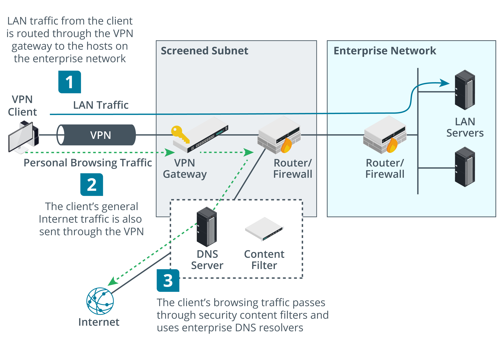

# Secure Network Protocols

### Objectives
- Impliment Secure Network Operations Protocols
- Impliment Secure Application Protocols
- Impliment Secure Remote Access Protocols

# Secure Network Operations Protocol
You will examine some of the protocols and services providing addressing, name resolution, directory services, time synchronization, and monitoring services for network hosts. These network operations protocols might not be as visible as applications such as web and email servers, but they are critical to secure network infrastructure.

## Network Address Allocation
DHCP provides automatic method for network address allocation to mostly worksations while servers are better off managed manually.\
One DHCP server is responsible for IP allocation to a group of hosts.

If a rogue DHCP server is set up, it can perform DoS (as client machines will obtain an incorrect TCP/IP configuration) or be used to snoop network information. DHCP starvation is a type of DoS attack where a rogue client repeatedly requests new IP addresses using spoofed MAC addresses, with the aim of exhausting the IP address pool. This makes it more likely that clients seeking an address lease will use the rogue DHCP server.\
If an attacker compromises the DHCP server, he or she could point network clients to rogue DNS servers and use that as a means to direct users to spoofed websites. Another attack is to redirect traffic through the attacker's machine by changing the default gateway, enabling the attacker to snoop on all network traffic.

Enabling the DHCP snooping port security feature on a switch can mitigate rogue DHCP attacks. Windows DHCP servers in an AD environment automatically log any traffic detected from unauthorized DHCP servers.

## Domain Name Resolution(DNS)
> The whois command can be used to lookup domain registration information to try to detect misuse in other cases.

It resolves Fully Qualified Domain Name (FQDNs) to IP addresses.\
It uses a distributed database system that contains information on domains and hosts within those domains. The information is distributed among many name servers, each of which holds part of the database. The name servers work over port 53. Domain name resolution is a security-critical service and the target of many attacks on both local network and the Internet.  

### Domain Hijacking
It is an attack where an adversary acquires a domain for a company's trading name or trademark, or perhaps some spelling variation thereof.\
In a domain hijacking attack an adversary gains control over the registration of a domain name, allowing the host records to be configured to IP addresses of the attacker's choosing.\
This might be accomplished by supplying false credentials to the domain registrar when applying for a new domain name or re-registering an existing one. An attacker might also be able to exploit the legitimate account used to manage the domain (via a weak password or malware installed on a client computer) or even to compromise the domain registrar's security procedures in some way (upguard.com/blog/domain-hijacking).

### Uniform Resource Locator(URL) redirection
A uniform resource locator (URL) is an address for the pages and files published on websites.  A URL comprises a FQDN, file path, and often script parameters.

URL redirection refers to the use of HTTP redirecting to open a page other than the one the user requested. This is often used for legitimate purposes—to send the user to a login page or to send a mobile device browser to a responsive version of the site, for instance. If the redirect is not properly validated by the web application, an attacker can craft a phishing link that might appear legitimate to a naïve user, such as:
> https://trusted.foo/login.php?url="https://tru5ted.foo

A threat actor could also compromise a web server and add redirects in .htaccess files. A redirect could also be inserted as JavaScript, either through compromising the server or by uploading a script via a poorly validated form.

### Domain Reputation
If your domain, website, or email servers have been hijacked, they are likely to be used for spam or distributing malware. This will lead to complaints and the likelihood of the domain being listed on a block list. You should set up monitoring using a site such as talosintelligence.com/reputation_center to detect misuse early.

### DNS Poisoning
DNS poisoning is an attack that compromises the process by which clients query name servers to locate the IP address for a Fully Qualified Domain Name (FQDN). There are several ways that a DNS poisoning attack can be perpetrated.
- Man in the Middle - If the threat actor has access to the same local network as the victim, the attacker can use Address Resolution Protocol (ARP) poisoning to impersonate a legitimate DNS server and respond to DNS queries from the victim with spoofed replies. This might be combined with a denial of service attack on the victim's legitimate DNS server. A rogue Dynamic Host Configuration Protocol (DHCP) could be used to configure clients with the address of a rogue DNS resolver.
- DNS Client Cache Poisoning -  Even though all name resolution now functions through DNS, the HOSTS file is still present and most operating systems check the file before using DNS. Its contents are loaded into a cache of known "name:IP address" mappings and the client only contacts a DNS server if the name is not cached. Therefore, if an attacker is able to place a false "name:IP address" mapping in the HOSTS file and effectively poison the DNS cache, he or she will be able to redirect traffic. The HOSTS file requires administrator access to modify. In UNIX and Linux systems it is stored as /etc/hosts, while in Windows it is placed in %SystemRoot%\System32\Drivers\etc\hosts.
- DNS Server Cache Poisoning - DNS server cache poisoning aims to corrupt the records held by the DNS server itself. This can be accomplished by performing DoS against the server that holds the authorized records for the domain, and then spoofing replies to requests from other name servers.\
 Another attack involves getting the victim name server to respond to a recursive query from the attacking host. A recursive query compels the DNS server to query the authoritative server for the answer on behalf of the client. The attacker's DNS, masquerading as the authoritative name server, responds with the answer to the query, but also includes a lot of false domain:IP mappings for other domains that the victim DNS accepts as genuine. The nslookup or dig tool can be used to query the name records and cached records held by a server to discover whether any false records have been inserted.

### DNS Security
On a private network, local DNS servers should only accept recursive queries from local hosts (preferably authenticated local hosts) and not from the Internet. You also need to implement access control measures on the server, to prevent a malicious user from altering records manually. Similarly, clients should be restricted to using authorized resolvers to perform name resolution.

DNS footprinting means obtaining information about a private network by using its DNS server to perform a zone transfer (all the records in a domain) to a rogue DNS or simply by querying the DNS service, using a tool such as nslookup or dig. To prevent this, you can apply an Access Control List to prevent zone transfers to unauthorized hosts or domains, to prevent an external server from obtaining information about the private network architecture.

DNS Security Extensions (DNSSEC) help to mitigate against spoofing and poisoning attacks by providing a validation process for DNS responses. With DNSSEC enabled, the authoritative server for the zone creates a "package" of resource records (called an RRset) signed with a private key (the Zone Signing Key). When another server requests a secure record exchange, the authoritative server returns the package along with its public key, which can be used to verify the signature.

## Secure Directory Services
A network directory lists the subjects (principally users, computers, and services) and objects (such as directories and files) available on the network plus the permissions that subjects have over objects. 

A network directory facilitates authentication and authorization, and it is critical that it be maintained as a highly secure service. Most directory services are based on the Lightweight Directory Access Protocol (LDAP), running over port 389. The basic protocol provides no security and all transmissions are in plaintext, making it vulnerable to sniffing and man-in-the-middle attacks. Authentication (referred to as binding to the server) can be implemented in the following ways:
- No authentication—anonymous access is granted to the directory.
- Simple bind—the client must supply its distinguished name (DN) and password, but these are passed as plaintext.
- Simple Authentication and Security Layer (SASL)—the client and server negotiate the use of a supported authentication mechanism, such as Kerberos. The STARTTLS command can be used to require encryption (sealing) and message integrity (signing). This is the preferred mechanism for Microsoft's Active Directory (AD) implementation of LDAP.
- LDAP Secure (LDAPS)—the server is installed with a digital certificate, which it uses to set up a secure tunnel for the user credential exchange. LDAPS uses port 636.

## Time Synchronization
Many applications on networks are time dependent and time critical. These include authentication and security mechanisms, scheduling applications, and backup software.

The Network Time Protocol (NTP) provides a transport over which to synchronize these time dependent applications. NTP works over UDP on port 123.\
Top-level NTP(stratum 1) obtain Coordinated Universal Time(UTC) from highly accurate source(atomic clock).
Lower tiers obtain UTC from stratum 1 servers and sample the results to obtain authoritative time.

Most organizations will use a stratum 2 server to obtain the time for use on the LAN. Servers at lower tiers may then perform the same sort of sampling operation, adjust for the delay involved in propagating the signal, and provide the time to clients. Clients themselves usually obtain the time using a modified form of the protocol (Simple NTP).\
Netwotk Time Security coming soon...

## Simple Network Management Protocol Security.(SNMP)
The Simple Network Management Protocol (SNMP) is a widely used framework for management and monitoring. SNMP consists of an SNMP monitor and agents.
- The agent is a process (software or firmware) running on a switch, router, server, or other SNMP-compatible network device.
- This agent maintains a database called a management information base (MIB) that holds statistics relating to the activity of the device (for example, the number of frames per second handled by a switch). The agent is also capable of initiating a trap operation where it informs the management system of a notable event (port failure, for instance). The threshold for triggering traps can be set for each value. Device queries take place over port 161 (UDP); traps are communicated over port 162 (also UDP).
- The SNMP monitor (a software program) provides a location from which network activity can be overseen. It monitors all agents by polling them at regular intervals for information from their MIBs and displays the information for review. It also displays any trap operations as alerts for the network administrator to assess and act upon as necessary.

# Secure Application Protocols

## Hypertext Transfer Protocol(HTTP)
HTTP enables clients (typically web browsers) to request resources from an HTTP server. A client connects to the HTTP server using an appropriate TCP port (the default is port 80) and submits a request for a resource, using a uniform resource locator (URL). The server acknowledges the request and responds with the data (or an error message).\
The response and request payload formats are defined in an HTTP header. The communications are not secure.

## Transport Layer Security(TLS)
Secure Sockets Layer (SSL) was developed by Netscape in the 1990s to address the lack of security in HTTP. SSL proved very popular with the industry, and it was quickly adopted as a standard named Transport Layer Security (TLS). It is typically used with HTTP (referred to as HTTPS or HTTP Secure) but can also be used to secure other application protocols and as a virtual private networking (VPN) solution.

To implement TLS, a server is assigned a digital certificate signed by some trusted certificate authority (CA). The certificate proves the identity of the server (assuming that the client trusts the CA) and validates the server's public/private key pair. The server uses its key pair and the TLS protocol to agree upon mutually supported ciphers with the client and negotiate an encrypted communications session.

### SSL/TLS Versions
SSl is unsafe to use so only tls1.2/1.3 are safe to use.\
One of the main features of TLS 1.3 is the removal of the ability to perform downgrade attacks by preventing the use of unsecure features and algorithms from previous versions. There are also changes to the handshake protocol to reduce the number of messages and speed up connections. 

### Cipher suites
A cipher suite is the group of algorithms supported by both the client and server to perform the different encryption and hashing operations required by the protocol. Prior to TLS 1.3, a cipher suite would be written in the following form:

> ECDHE-RSA-AES128-GCM-SHA256
the server can use Elliptic Curve Diffie-Hellman Ephemeral mode for session key agreement, RSA signatures, 128-bit AES-GCM (Galois Counter Mode) for symmetric bulk encryption, and 256-bit SHA for HMAC functions. 

1.3 uses simlified and shortened suites
> TLS_AES_256_GCM_SHA384
Only ephemeral key agreement is supported in 1.3 and the signature type is supplied in the certificate, so the cipher suite only lists the bulk encryption key strength and mode of operation (AES_256_GCM), plus the cryptographic hash algorithm (SHA384) used within the new hash key derivation function (HKDF). HKDF is the mechanism by which the shared secret established by Diffie Hellman key agreement is used to derive symmetric session keys.

## API Considerations
Use of these APIs is authorized via a token or secret key. Effective management of these API secrets is an essential consideration in modern networks, as they have been widely used to perpetrate various breaches and data thefts. For example, putting the key in the URL carries a severe risk of exposure. APIs can use more secure authentication and authorization methods, such as SAML and OAuth, but these still come with secrets management requirements. Another API consideration is that usage should be monitored to ensure only authorized endpoints are making transactions. 

## File Transfer Services
There are many means of transferring files across networks. A network operating system can host shared folders and files, enabling them to be copied or accessed over the local network or via remote access (over a VPN, for instance).

### File Transfer Protocol(FTP)
It  is typically configured with several public directories, hosting files, and user accounts. Most HTTP servers also function as FTP servers, and FTP services, accounts, and directories may be installed and enabled by default when you install a web server.\
No security mechanisms. All authentication and data transfer are communicated as plaintext, meaning that credentials can easily be picked out of any intercepted FTP traffic.

### SSH FTP(SFTP) and FTP Over SSL(FTPS)
SSH FTP (SFTP) addresses the privacy and integrity issues of FTP by encrypting the authentication and data transfer between client and server. In SFTP, a secure link is created between the client and server using Secure Shell (SSH) over TCP port 22. Ordinary FTP commands and data transfer can then be sent over the secure link without risk of eavesdropping or man-in-the-middle attacks. This solution requires an SSH server that supports SFTP and SFTP client software.

Another means of securing FTP is to use the connection security protocol SSL/TLS. There are two means of doing this:

- Explicit TLS (FTPES)—use the AUTH TLS command to upgrade an unsecure connection established over port 21 to a secure one. This protects authentication credentials. The data connection for the actual file transfers can also be encrypted (using the PROT command).
- Implicit TLS (FTPS)—negotiate an SSL/TLS tunnel before the exchange of any FTP commands. This mode uses the secure port 990 for the control connection.

FTPS is tricky to configure when there are firewalls between the client and server. Consequently, FTPES is usually the preferred method.

## Email Services
Two types of protocols
- The Simple Mail Transfer Protocol (SMTP) transmits email messages from one system to another.
- The Post Office Protocol v3 (POP3) receives email messages from an email server to store on a client computer.

### SMTP
A sender's smtp server discovers IP address of recipients smtp server usinf domain name of recipients email address. The smtp server for the domain is registered in DNS using MailExchanger(MX) record.

SMTP communications can be secured using TLS using a certificate on smtp server.There sre 2 ways:-
- STARTTLS—this is a command that upgrades an existing unsecure connection to use TLS. This is also referred to as explicit TLS or opportunistic TLS.
- SMTPS—this establishes the secure connection before any SMTP commands (HELO, for instance) are exchanged. This is also referred to as implicit TLS

The STARTTLS method is generally more widely implemented than SMTPS. Typical SMTP configurations use the following ports and secure services:

- Port 25—used for message relay (between SMTP servers or Message Transfer Agents [MTA]). If security is required and supported by both servers, the STARTTLS command can be used to set up the secure connection.
- Port 587—used by mail clients (Message Submission Agents [MSA]) to submit messages for delivery by an SMTP server. Servers configured to support port 587 should use STARTTLS and require authentication before message submission.
- Port 465—some providers and mail clients use this port for message submission over implicit TLS (SMTPS), though this usage is now deprecated by standards documentation. 

### POP(POP3S)
When a recipient’s email client connects to a server mailbox, POP3 downloads the email messages.It establishes a TCP connection to the POP3 server over port 110. The user is authenticated (by username and password) and the contents of his or her mailbox are downloaded for processing on the local PC. POP3S is the secured version of the protocol, operating over TCP port 995 by default.

### Secure IMAP(IMAPS)
Compared to POP3, the Internet Message Access Protocol v4 (IMAP4) supports permanent connections to a server and connecting multiple clients to the same mailbox simultaneously. It also allows a client to manage mail folders on the server. Clients connect to IMAP over TCP port 143. They authenticate themselves then retrieve messages from the designated folders. As with other email protocols, the connection can be secured by establishing an SSL/TLS tunnel. The default port for IMAPS is TCP port 993.

## Secure/MultiPurpose Internet Mail Extensions(S/MIME)
Consequently, there is still a need for authentication and confidentiality to be applied on a per-message basis. One means of doing this is called Secure/Multipurpose Internet Mail Extensions (S/MIME). To use S/MIME, the user is issued a digital certificate containing his or her public key, signed by a CA to establish its validity. The public key is paired with a private key that is kept secret by the user. To establish the exchange of secure emails, both users must be using S/MIME and exchange certificates:

- Alice sends Bob her digital certificate, containing her public key and validated digital ID (an email address). She signs this message using her private key.
- Bob uses the public key in the certificate to decode her signature and the signature of the CA (or chain of CAs) validating her digital certificate and digital ID and decides that he can trust Alice and her email address.
- He responds with his digital certificate and public key and Alice, following the same process, decides to trust Bob.
- Both Alice and Bob now have one another's certificates in their trusted certificate stores.
- When Alice wants to send Bob a confidential message, she makes a hash of the message and signs the hash using her private key. She then encrypts the message, hash, and her public key using Bob's public key and sends a message to Bob with this data as an S/MIME attachment.
- Bob receives the message and decrypts the attachment using his private key. He validates the signature and the integrity of the message by decrypting it with Alice's public key and comparing her hash value with one he makes himself.

## Voice and Video Services
Voice over IP (VoIP), web conferencing, and video teleconferencing (VTC) solutions have become standard methods for the provision of business communications. The main challenges that these applications have in common is that they transfer real-time data and must create point-to-point links between hosts on different networks.\
Encrypted data is carried over by Real-Time Transport Protocol(SRTP)

******************************************************

# Secure Remote Access Protocols

## Transport Layer Security VPN
Legacy protocols such as Point to point Tunneling Protocol(PPTP)
have been deprecated because of inadequate security.\
Transport Layer Security(TLS) and IPSec are now used.

- TLS VPN(SSL VPN, port 443(/arbitrary port)) -  The client makes a connection to the server using TLS so that the server is authenticated to the client (and optionally the client's certificate must be authenticated by the server). This creates an encrypted tunnel for the user to submit authentication credentials, which would normally be processed by a RADIUS server. Once the user is authenticated and the connection fully established, the VPN gateway tunnels all communications for the local network over the secure socket. 

OpenVPN is an open source example of TLS VPN.It can work in TAP(bridged) mode to tunnel layer 2 frames or in TUN(routed) mode to forward IP packets.

Microsofts`s Secure Socket Tunneling Protocol(SSTP) which worls by tunneling Point to Point Protocol(PPP) layer 2 frames over a TLS session. The Point-to-Point Protocol (PPP) is a widely used remote dial-in protocol. It provides encapsulation for IP traffic plus IP address assignment and authentication via the widely supported Challenge Handshake Authentication Protocol (CHAP).

## Internet Protocol Security
IPSec can provide both confidentiality (by encrypting data packets) and integrity/anti-replay (by signing each packet). The main drawback is that it adds overhead to data communications. IPSec can be used to secure communications on local networks and as a remote access protocol.

Each host that uses IPSec must be assigned a policy. An IPSec policy sets the authentication mechanism and also the protocols and mode for the connection. Hosts must be able to match at least one matching security method for a connection to be established. There are two core protocols in IPSec, which can be applied singly or together, depending on the policy

- Authentication Header(AH) Protocol\
     performs a cryptographic hash on the whole packet, including the IP header, plus a shared secret key (known only to the communicating hosts), and adds this HMAC in its header as an Integrity Check Value (ICV).\
    The recipient performs the same function on the packet and key and should derive the same value to confirm that the packet has not been modified.\
    The payload is not encrypted so this protocol does not provide confidentiality. Also, the inclusion of IP header fields in the ICV means that the check will fail across NAT gateways, where the IP address is rewritten. Consequently, AH is not often used.
    
- Encapsulation Security Payload(ESP)\
    It provides confidentiality and/or authentication and integrity. It can be used to encrypt the packet rather than simply calculating an HMAC. ESP attaches three fields to the packet: a header, a trailer (providing padding for the cryptographic function), and an Integrity Check Value. Unlike AH, ESP excludes the IP header when calculating the ICV.
    

## IPSecurity Transport and Tunnel Modes
It can be used in 2 modes:
- Transport Mode \
It is used to secure communications btwn hosts on a private network(an end to end implimentation).When ESP is applied in transport mode, the IP header for each packet is not encrypted, just the payload data. If AH is used in transport mode, it can provide integrity for the IP header.

- Tunnel Mode \
this mode is used for communications between VPN gateways across an unsecure network (creating a VPN). This is also referred to as a router implementation. With ESP, the whole IP packet (header and payload) is encrypted and encapsulated as a datagram with a new IP header. AH has no real use case in tunnel mode, as confidentiality will usually be required.

## Internet Key Exchange(IKE)
IPSec's encryption and hashing functions depend on a shared secret. The secret must be communicated to both hosts and the hosts must confirm one another's identity (mutual authentication). Otherwise, the connection is vulnerable to man-in-the-middle and spoofing attacks. The Internet Key Exchange (IKE) protocol handles authentication and key exchange, referred to as Security Associations (SA).

It takes place in 2 phases:
- Phase I establishes the identity of the two hosts and performs key agreement using the Diffie-Hellman algorithm to create a secure channel. Two methods of authenticating hosts are commonly used:
    - Digital certificates—the hosts use certificates issued by a mutually trusted certificate authority to identify one another.
    - Pre-shared key (group authentication)—the same passphrase is configured on both hosts.

- Phase II uses the secure channel created in Phase I to establish which ciphers and key sizes will be used with AH and/or ESP in the IPSec session.

## Layer 2 Tunneling Protocol and IKE V2
This first version of IKE is optimized to ensure the mutual authentication of two peer hosts, such as in a site-to-site VPN.\
On its own, it does not provide a simple means for a client user account to authenticate to a remote network directory. Consequently, for remote access VPNs, a combination of IPSec with the Layer 2 Tunneling Protocol (L2TP) VPN protocol is often used.

Compared to L2TP/IPSec, using IKE v2 is more efficient. This solution is becoming much better supported, with native support in Windows 10, for instance. 

### Layer 2 Tunneling Protocl/IPSec VPN
- The client and VPN gateway set up a secure IPSec channel over the Internet, using either a pre-shared key or certificates for IKE.
- The VPN gateway uses L2TP to set up a tunnel to exchange local network data encapsulated as Point-to-Point Protocol (PPP) frames. This double encapsulation of traffic is the main drawback, as it adds overhead.
- The user authenticates over the PPP session using EAP or CHAP

### IKE v2
IKE v2 has some additional features that have made the protocol popular for use as a standalone remote access VPN solution. The main changes are:
- Support for EAP authentication methods, allowing, for example, user authentication against a RADIUS server.
- Simplified connection set up—IKE v2 specifies a single 4-message setup mode, reducing bandwidth without compromising security.
- Reliability - Supports NAT traversal allowing a client device to switch multiple interfaces

## VPN Client Configuration
### Always-On VPN
Traditional remote access VPN solutions require the user to initiate the connection and enter their authentication credentials. An always-on VPN means that the computer establishes the VPN whenever an Internet connection over a trusted network is detected, using the user's cached credentials to authenticate. 

### Split Tunnel Versus Full tunnel
When a client connected to a remote access VPN tries to access other sites on the Internet, there are two ways to manage the connection
- Split tunnel - the client accesses the Internet directly using its "native" IP configuration and DNS servers.

- Full tunnel - Internet access is mediated by the corporate network, which will alter the client's IP address and DNS servers and may use a proxy.

## Remote Desktop Protocol
Another model for remote networking involves connecting to a host within the local network over a remote administration protocol.

A protocol such as Secure Shell (SSH) traditionally provides terminal access, and there are many tools that can connect to a graphical desktop. A GUI remote administration tool sends screen and audio data from the remote host to the client and transfers mouse and keyboard input from the client to the remote host.

Traditionally, these remote desktop products require a client app. The canvas element introduced in HTML5 allows a browser to draw and update a desktop with relatively little lag. It can also handle audio. This is referred to as an HTML5 VPN or as a clientless remote desktop gateway (guacamole.apache.org). This solution also uses a protocol called WebSockets, which enables bidirectional messages to be sent between the server and client without requiring the overhead of separate HTTP requests.

## Out of Band Management and Jump Servers
